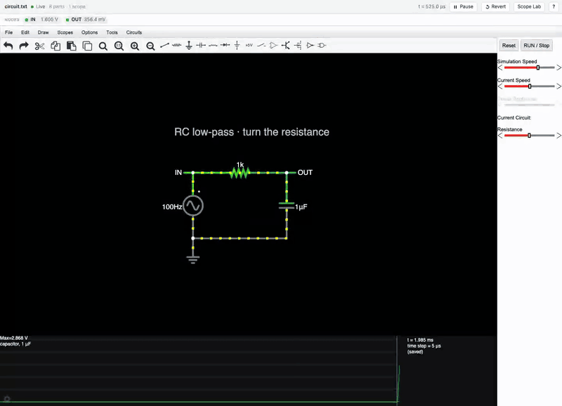
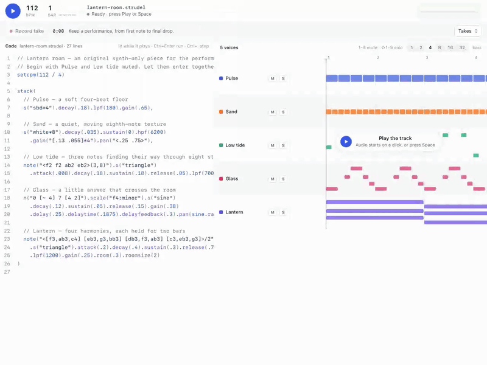
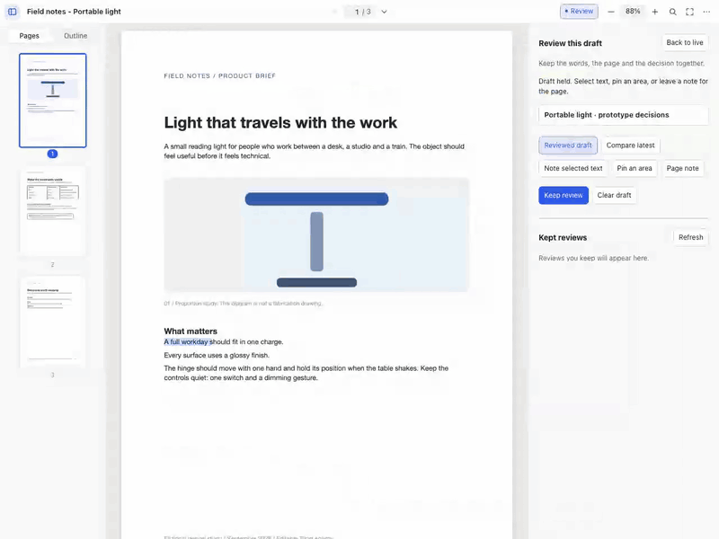
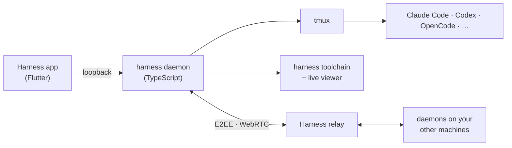

<p align="center">
  
</p>

<h1 align="center">OpenHarness</h1>

<p align="center">
  <b>The terminal for coding agents.</b><br>
  Every agent. Every machine. One fast, keyboard-first window.
</p>

<p align="center">
  <a href="https://harness.autonomous.ai/desktop"><b>Download</b></a> ·
  <a href="#get-started">Get started</a> ·
  <a href="docs/keyboard.md">Keybindings</a> ·
  <a href="docs/architecture.md">How it works</a> ·
  <a href="#beyond-code">Beyond code</a>
</p>

### Every agent, side by side

Claude Code, Codex, Cursor, OpenCode, Devin, Amp, Copilot and seven more.

<p align="center"></p>

### Every machine, side by side

Laptop, home server, work desktop, GPU box. No SSH. No Tailscale. No open ports.

<p align="center"></p>

### Keyboard first

⌘O finds any session on any machine. ⇧⌘I jumps to the agent waiting on you. ⌘D splits. Every key remaps.

<p align="center"></p>

### End-to-end encrypted

Code, keys and keystrokes are sealed on your machine. The relay forwards bytes it can't read.

<p align="center"></p>

### Fast and light

A native app, not Electron. Real terminals on tmux. Close the app and your agents keep working.

| Action | Median | p95 |
|---|---:|---:|
| ⌘N new harness | 13.5 ms | 14.6 ms |
| ⌘O open anything | 15.7 ms | 18.4 ms |
| ⌘P every command | 14.7 ms | 15.2 ms |
| ⌘F find in a terminal | 12.5 ms | 18.3 ms |
| Focus a pane | 11.4 ms | 17.2 ms |
| Zoom a pane | 14.8 ms | 17.2 ms |
| Next tab | 17.8 ms | 24.2 ms |

Key dispatch to finished frame. Release build, M2 Max, 16 live terminals. A window in the background
runs zero timers. [How we measure](https://github.com/autonomous-ai/openharness/blob/codex/perf-integration-checkpoint/docs/performance/2026-09-22-desktop-latency.md).

## Beyond code

**Coding agents can build far more than software.** Give one a harness and it works with the real
tools of a craft. You steer in a live viewer. Every clip below is a real session.

### Beyond code: Design

**Blender.** Ask for a lamp and the sliders that matter. Turn them and Blender rebuilds the geometry. Keep the versions you love.

<p align="center"></p>

<p align="center"><a href="docs/hands-on.md#blender-shape-it-until-it-feels-right">Try it</a> · <a href="https://github.com/user-attachments/assets/dc152a0b-94b6-4324-9d30-468b7ed3d14b">Full video</a> · <a href="store/agents/blender/">Harness</a></p>

### Beyond code: Circuits

**CircuitJS.** Build a filter. Change one resistor. Overlay the new trace, measure the difference and keep both.

<p align="center"></p>

<p align="center"><a href="docs/hands-on.md#circuitjs-see-what-changed-in-the-signal">Try it</a> · <a href="https://github.com/user-attachments/assets/6fb1892a-23a2-49ba-9698-4e71a404f1f4">Full video</a> · <a href="store/agents/circuitjs/">Harness</a></p>

### Beyond code: Robotics

**MuJoCo.** Pin a moment in a robot's run. Shove it with 100 N. Watch two futures split and find where they part.

<p align="center"></p>

<p align="center"><a href="docs/hands-on.md#mujoco-try-a-different-world">Try it</a> · <a href="https://github.com/user-attachments/assets/bc214f57-7967-4e4b-9fe2-b722a033157d">Full video</a> · <a href="store/agents/mujoco/">Harness</a></p>

### Beyond code: Games

**Godogen.** Your agent makes a playable game. Miss a jump, rewind, try again. Pin the moment so the agent sees what you mean.

<p align="center"></p>

<p align="center"><a href="docs/hands-on.md#godogen-try-that-moment-again">Try it</a> · <a href="https://github.com/user-attachments/assets/ee9e1af9-e92b-4a76-8583-36e2ee7ea4ec">Full video</a> · <a href="store/agents/godogen/">Harness</a></p>

### Beyond code: Music

**Strudel.** The track is code you can perform. Bring voices in and out, mark the good parts, keep the WAV.

<p align="center"></p>

<p align="center"><a href="docs/hands-on.md#strudel-perform-the-version-you-love">Try it</a> · <a href="https://github.com/user-attachments/assets/a3d4381b-5f55-406c-9d68-330cd8792fc5">Full video with sound</a> · <a href="store/agents/strudel/">Harness</a></p>

### Beyond code: Chemistry

**RDKit.** Turn a bond and watch the molecule move. Follow the real energy curve. Keep the pose worth a closer look.

<p align="center"></p>

<p align="center"><a href="docs/hands-on.md#rdkit-see-a-molecule-turn">Try it</a> · <a href="https://github.com/user-attachments/assets/a7132b72-db46-4873-b412-ef5c2b400a8e">Full video</a> · <a href="store/agents/rdkit/">Harness</a></p>

### Beyond code: Documents

**Typst.** Your agent writes a real PDF. Circle a detail, quote a line, leave a note. The next draft answers it.

<p align="center"></p>

<p align="center"><a href="docs/hands-on.md#typst-point-at-what-you-mean">Try it</a> · <a href="https://github.com/user-attachments/assets/603d7d8d-941d-41d1-8a17-5765487aafea">Full video</a> · <a href="store/agents/typst/">Harness</a></p>

### Beyond code: Data

**Jev Sheets.** Test a question on a few frozen rows before you ask the whole sheet. Compare two wordings side by side.

<p align="center"></p>

<p align="center"><a href="docs/hands-on.md#jev-sheets-ask-a-better-question">Try it</a> · <a href="https://github.com/user-attachments/assets/afc30e73-2f0a-442e-b929-79126adea76b">Full video</a> · <a href="store/agents/jev-sheets/">Harness</a></p>

Monday, a feature. Tuesday, an enclosure. Wednesday, the launch video.
For the curious engineer who wants to build beyond software. [Browse all 49 harnesses](#domain-specific-harnesses-dsh).

<a id="run-it"></a>
## Get started

1. [Download the app](https://harness.autonomous.ai/desktop) for macOS or Linux.
2. Sign in to an agent you already use.
3. Press **⌘N**, type a task, press **Return**.

Add a machine. Run this on it, then **Machines → Link Machine** in the app:

```bash
curl -fsSL https://harness.autonomous.ai/cli/install.sh | bash
harness login
harness remote-password set
harness start
```

macOS is the primary platform. Linux builds work with parity in progress; Windows is in progress. Live viewers need macOS.
The app needs a Harness account for now; [account-free local use is tracked](docs/development.md#account-free-local-use).

<details>
<summary><b>Build from source</b></summary>

Needs Node.js 20+, tmux, Xcode and Flutter 3.47+ / Dart 3.13+:

```bash
git clone https://github.com/autonomous-ai/openharness.git
cd openharness
(cd cli && npm ci)
make install-cli
cd desktop
flutter config --enable-swift-package-manager
flutter pub get
flutter run -d macos
```

`make install-cli` installs this checkout's CLI and restarts the local daemon. See the
[development guide](docs/development.md).

</details>

<details>
<summary><b>How it fits together</b></summary>



Each daemon dials out to the relay, so no machine opens a port. Frames are sealed with
ChaCha20-Poly1305 under X25519 session keys and pinned Ed25519 identities. Terminal traffic goes
peer to peer over WebRTC when the network allows. Details in the [architecture guide](docs/architecture.md).

</details>

<a id="domain-specific-harnesses-dsh"></a>
## Build a harness

A harness turns a coding agent into a specialist: instructions, a pinned toolchain, a project
template and a live viewer, in one folder. Adding a craft never touches the app.

```bash
harness dsh install "$PWD/store/viewers/web-viewer" --link
cp -R store/examples/hello-world ../my-harness
harness dsh check ../my-harness
harness dsh install ../my-harness --link
```

Press **⌘N → Hello World** and say hello. The [authoring guide](store/README.md) covers the rest.

<details>
<summary><b>Browse every harness in the Store</b></summary>

<!-- store-catalog:start -->
### Coding and beyond

Start with a coding agent you already use. Explore 49 domain-specific harnesses when your
next idea takes you further.

| Category | Agents and harnesses |
|---|---|
| **Coding** | [Claude Code, Codex, Cursor, OpenCode, Pi, Hermes, Command Code, Devin, Muse Code, Amp, Antigravity, GitHub Copilot, Grok Build, Kilo Code](docs/engines.md), [Harness Monitor](store/agents/harness-monitor/), [Machine Monitor](store/agents/machine-monitor/) |
| Design | [Autonomous Workshop](store/agents/autonomous-workshop/), [Blender](store/agents/blender/), [Bonsai MCP](store/agents/bonsai-mcp/), [Creative Direction](store/agents/creative-direction/), [Excalidraw](store/agents/excalidraw/), [FreeCAD](store/agents/freecad/), [Generative Art](store/agents/generative-art/), [OpenSCAD](store/agents/openscad/), [text-to-cad](store/agents/text-to-cad/) |
| Engineering | [Autonomous Circuit](store/agents/autonomous-circuit/), [CircuitJS](store/agents/circuitjs/), [Home Assistant](store/agents/home-assistant/), [KiCad](store/agents/kicad/), [Orca Slicer](store/agents/orca-slicer/), [Yosys](store/agents/yosys/) |
| Media | [Comfy MCP](store/agents/comfy-mcp/), [Manim](store/agents/manim/), [OpenMontage](store/agents/openmontage/), [Remotion](store/agents/remotion/) |
| Music | [Ableton AI](store/agents/ableton-ai/), [JUCE Agent Toolkit](store/agents/juce-agent-toolkit/), [Music Studio](store/agents/music-studio/), [Score](store/agents/score/), [Strudel](store/agents/strudel/) |
| Productivity | [Jev Sheets](store/agents/jev-sheets/), [Marp](store/agents/marp/), [Typst](store/agents/typst/) |
| Science & Data | [autoresearch-mlx](store/agents/autoresearch-mlx/), [Data Studio](store/agents/data-studio/), [Lab Bench](store/agents/lab-bench/), [marimo](store/agents/marimo/), [RDKit](store/agents/rdkit/) |
| Simulation | [DimOS](store/agents/dimos/), [Drone Pilot](store/agents/drone-pilot/), [Foam-Agent](store/agents/foam-agent/), [MuJoCo](store/agents/mujoco/), [SimSkill](store/agents/simskill/) |
| Games | [Game Master](store/agents/game-master/), [Godogen](store/agents/godogen/), [Phaser](store/agents/phaser/), [Voxel Worlds](store/agents/voxel-worlds/) |
| Research | [Jev Browser](store/agents/jev-browser/), [Roundtable](store/agents/roundtable/) |
| Local AI | [Grid](store/agents/autonomous-grid/), [MLX-LM](store/agents/mlx-lm/), [Ollama](store/agents/ollama/), [vLLM](store/agents/vllm/) |

These are the 49 harnesses currently listed in the Store catalog. They combine upstream
open-source tools and original workflows, with instructions, setup, checks, and live views for each craft.

The 10 [shared viewers](store/viewers/) cover CAD, 3D models, documents, games, film, video,
MuJoCo, web pages, isolated web previews, and studios. Viewer packages install alongside the
harnesses that need them. Experimental packages marked unlisted are not included above.
<!-- store-catalog:end -->

</details>

## Harness device

<p align="center"></p>

A round screen beside your keyboard. See who's working, who's done and who needs you. Answer with a tap
or your voice. Open hardware: [firmware](devices/harness-device/firmware/),
[PCB](devices/harness-device/hardware/pcb/), [enclosure](devices/harness-device/hardware/3d/).
[Get one](https://www.autonomous.ai/harness) or build your own.

## Contribute

Make a harness for a tool you love. Improve terminals, engines, the daemon or the relay. Port the
firmware. Start with the [contribution guide](CONTRIBUTING.md).

[Development](docs/development.md) · [Extending](docs/extending.md) · [CLI](docs/cli.md) ·
[Security](SECURITY.md) · [MIT license](LICENSE); upstream tools keep their own.
