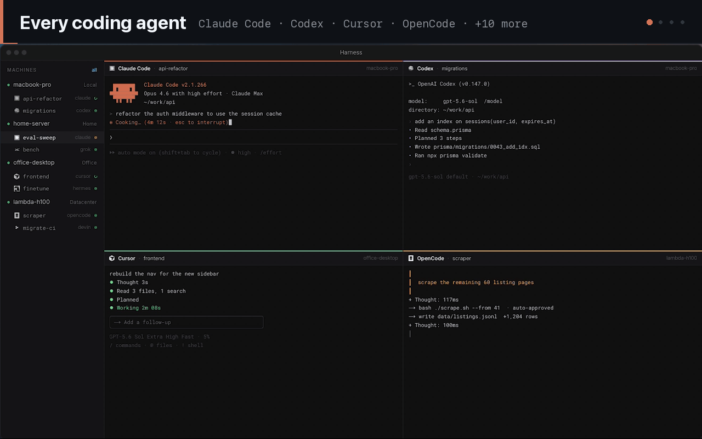
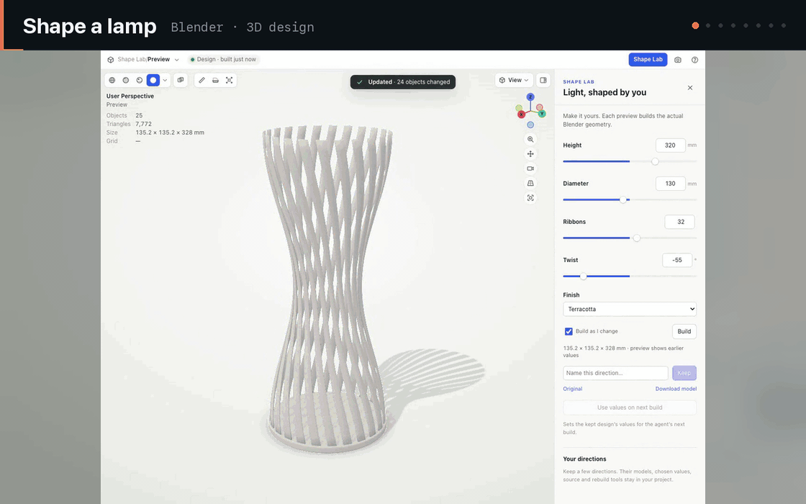
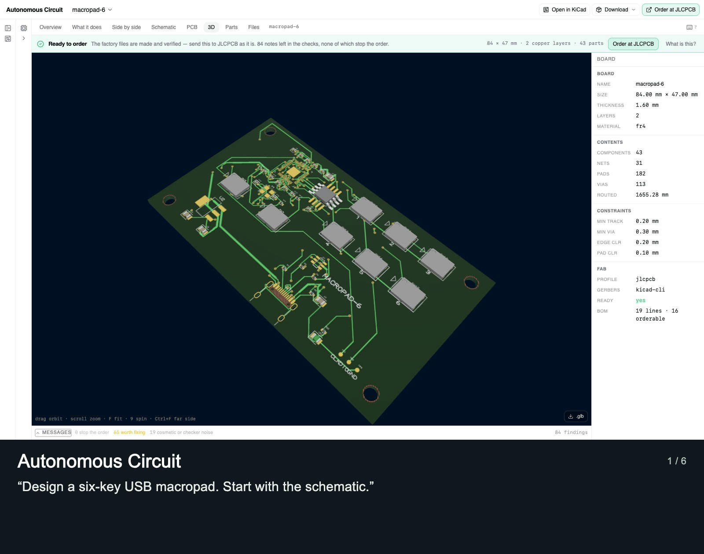
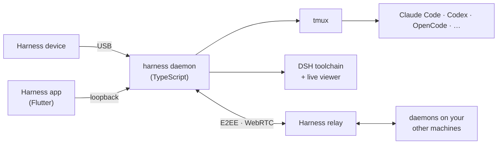
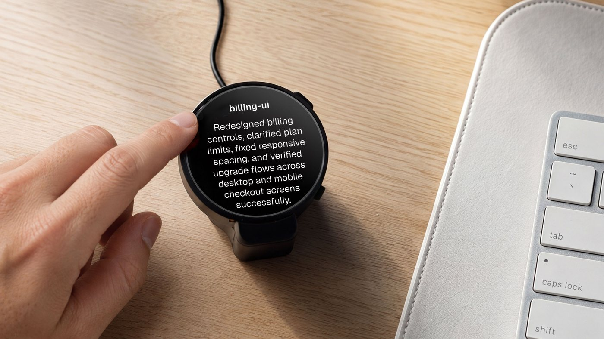

# All your coding agents. All your machines. One window.

**OpenHarness** runs Claude Code, Codex, Cursor and every agent you use, side by side, on every
machine you own. Open source, top to bottom.

- **Every agent.** Claude Code, Codex, Cursor, OpenCode, Devin, Amp, Copilot and seven more. Your subscriptions, your keys.
- **Every machine.** Laptop, home server, work desktop, GPU box. No SSH. No Tailscale. It just works.
- **End-to-end encrypted.** Always on. The relay only ever sees ciphertext.
- **Keyboard first.** Every action has a key. Vim-style moves. Remap anything.
- **Fast and light.** A native app with real terminals. Agents live in tmux and keep working when the app is closed.

**[Download for macOS and Linux](https://harness.autonomous.ai/desktop)** · [Get started](#run-it) · [Keybindings](docs/keyboard.md) · [Beyond code](#beyond-code)

<p align="center">
  <a href="https://cdn.autonomous.ai/development/ecm/260910/Thumb-harness-app.mp4"></a>
</p>

## Beyond code

**Coding agents can build far more than software.** Give one a harness for a craft and it shapes a
lamp in Blender, shoves a robot in MuJoCo or performs a track in Strudel. You steer in a live viewer.

<p align="center">
  <a href="docs/hands-on.md"></a>
</p>

Every clip is a real session with the real tool. [Watch them all and try one](docs/hands-on.md).

> “World-class entrepreneurs are polymaths.” — [Peter Thiel](https://www.youtube.com/watch?v=h10kXgTdhNU&t=811s)

Monday, a feature. Tuesday, the customer data. Wednesday, an enclosure. Thursday, the launch video.
You bring the idea and the taste. Your agents bring the craft. Built for the curious engineer who
wants to build beyond software.

<details>
<summary><b>More things made with Harness</b></summary>

<!-- store-showcase:start -->
<p align="center">
  <a href=".github/assets/store/showcase.gif"></a>
</p>

Six real outputs, one at a time. Each slide includes the harness and the original prompt.
[Still preview](.github/assets/store/showcase-poster.png) · Individual images and prompts below.

<details>
<summary>Read the prompts and open individual images</summary>

**[Autonomous Circuit](store/showcase/autonomous-circuit/six-key-macropad.jpg)** · [Open harness](store/agents/autonomous-circuit/)

> Design a six-key USB macropad. Start with the schematic.

**[text-to-cad](store/showcase/text-to-cad/planetary-gear-set.jpg)** · [Open harness](store/agents/text-to-cad/)

> Design a 3D-printable planetary gear set: a 12-tooth sun, three 18-tooth planets and a 48-tooth ring gear with mounting lugs, module 1.5 and 8 mm thick, plus a carrier on steel pins. Give each part its own colour.

**[MuJoCo](store/showcase/mujoco/g1-humanoid-hello.jpg)** · [Open harness](store/agents/mujoco/)

> Make the Unitree G1 humanoid say hello: stand, raise its right hand and wave three times, then lower it and take a small bow. Record it.

**[Blender](store/showcase/blender/cozy-reading-nook.jpg)** · [Open harness](store/agents/blender/)

> Make a cozy isometric reading nook: a cut-away corner of a room with an armchair, a floor lamp glowing warm, a bookshelf full of colourful books, a round rug and a monstera, with evening sun through the window and a cat asleep on the rug.

**[Godogen](store/showcase/godogen/neon-drift.jpg)** · [Open harness](store/agents/godogen/)

> Make a synthwave hoverbike racer: ride down a neon grid canyon toward a striped setting sun, weave between glowing pylons, hop barriers and collect energy cores, with a boost and three shields.

**[Manim](store/showcase/manim/fourier-knight.jpg)** · [Open harness](store/agents/manim/)

> Draw a chess knight using nothing but spinning circles: a Fourier series of 120 epicycles, tip to tail, tracing its silhouette in gold.

</details>
<!-- store-showcase:end -->

</details>

## Domain-specific harnesses (DSH)

A harness turns a coding agent into a specialist. It is a folder with a `harness.json`:
instructions, a pinned toolchain, a project template and a live viewer. Adding a craft never
touches the app or the daemon.

<details>
<summary><b>Browse all harnesses in the Store</b></summary>

<!-- store-catalog:start -->
### Coding and beyond

Start with a coding agent you already use. Explore 49 domain-specific harnesses when your
next idea takes you further.

| Category | Agents and harnesses |
|---|---|
| **Coding** | [Claude Code, Codex, Cursor, OpenCode, Pi, Hermes, Command Code, Devin, Muse Code, Amp, Antigravity, GitHub Copilot, Grok Build, Kilo Code](docs/engines.md), [Harness Monitor](store/agents/harness-monitor/), [Machine Monitor](store/agents/machine-monitor/) |
| Design | [Autonomous Workshop](store/agents/autonomous-workshop/), [Blender](store/agents/blender/), [Bonsai MCP](store/agents/bonsai-mcp/), [Creative Direction](store/agents/creative-direction/), [Excalidraw](store/agents/excalidraw/), [FreeCAD](store/agents/freecad/), [Generative Art](store/agents/generative-art/), [OpenSCAD](store/agents/openscad/), [text-to-cad](store/agents/text-to-cad/) |
| Engineering | [Autonomous Circuit](store/agents/autonomous-circuit/), [CircuitJS](store/agents/circuitjs/), [Home Assistant](store/agents/home-assistant/), [KiCad](store/agents/kicad/), [Orca Slicer](store/agents/orca-slicer/), [Yosys](store/agents/yosys/) |
| Media | [Comfy MCP](store/agents/comfy-mcp/), [Manim](store/agents/manim/), [OpenMontage](store/agents/openmontage/), [Remotion](store/agents/remotion/) |
| Music | [Ableton AI](store/agents/ableton-ai/), [JUCE Agent Toolkit](store/agents/juce-agent-toolkit/), [Music Studio](store/agents/music-studio/), [Score](store/agents/score/), [Strudel](store/agents/strudel/) |
| Productivity | [Jev Sheets](store/agents/jev-sheets/), [Marp](store/agents/marp/), [Typst](store/agents/typst/) |
| Science & Data | [autoresearch-mlx](store/agents/autoresearch-mlx/), [Data Studio](store/agents/data-studio/), [Lab Bench](store/agents/lab-bench/), [marimo](store/agents/marimo/), [RDKit](store/agents/rdkit/) |
| Simulation | [DimOS](store/agents/dimos/), [Drone Pilot](store/agents/drone-pilot/), [Foam-Agent](store/agents/foam-agent/), [MuJoCo](store/agents/mujoco/), [SimSkill](store/agents/simskill/) |
| Games | [Game Master](store/agents/game-master/), [Godogen](store/agents/godogen/), [Phaser](store/agents/phaser/), [Voxel Worlds](store/agents/voxel-worlds/) |
| Research | [Jev Browser](store/agents/jev-browser/), [Roundtable](store/agents/roundtable/) |
| Local AI | [Grid](store/agents/autonomous-grid/), [MLX-LM](store/agents/mlx-lm/), [Ollama](store/agents/ollama/), [vLLM](store/agents/vllm/) |

These are the 49 harnesses currently listed in the Store catalog. They combine upstream
open-source tools and original workflows, with instructions, setup, checks, and live views for each craft.

The 10 [shared viewers](store/viewers/) cover CAD, 3D models, documents, games, film, video,
MuJoCo, web pages, isolated web previews, and studios. Viewer packages install alongside the
harnesses that need them. Experimental packages marked unlisted are not included above.
<!-- store-catalog:end -->

</details>

**Build the harness for your craft.** Wrap a tool you love or your company's toolchain. It can live
here or in your own repo.

```json
{
  "spec": 1,
  "id": "examples/hello-world",
  "name": "Hello World",
  "engine": "codex",
  "workspace": { "template": "template", "marker": "index.html" },
  "agent": { "instructions": "AGENTS.md" },
  "viewer": { "use": "autonomous/web-viewer" }
}
```

```bash
harness dsh install "$PWD/store/viewers/web-viewer" --link
cp -R store/examples/hello-world ../my-first-harness
harness dsh check ../my-first-harness
harness dsh install ../my-first-harness --link
```

Press **⌘N → Hello World** and ask it to “Say hello to Ada.” The agent edits the page and the viewer
reloads. The [authoring guide](store/README.md) and [package spec](store/spec/README.md) cover the rest.

## Run it

1. [Download the app](https://harness.autonomous.ai/desktop).
2. Sign in to an agent you already use: subscription, API key or local model.
3. Press **⌘N**. Pick an agent, a machine and a project. Go.

Add another machine in three commands, then **Machines → Link Machine**:

```bash
curl -fsSL https://harness.autonomous.ai/cli/install.sh | bash
harness login
harness start
```

macOS is the primary platform. Linux builds work with parity in progress; Windows is in progress.
Live viewers need macOS. The app needs a Harness account for now;
[account-free local use is tracked](docs/development.md#account-free-local-use).

<details>
<summary><b>Build from source</b></summary>

Needs Node.js 20+, tmux, Xcode and Flutter 3.47+ / Dart 3.13+:

```bash
git clone https://github.com/autonomous-ai/openharness.git
cd openharness
(cd cli && npm ci)
make install-cli
cd desktop
flutter config --enable-swift-package-manager
flutter pub get
flutter run -d macos
```

`make install-cli` installs this checkout's CLI and restarts the local daemon. See the
[development guide](docs/development.md).

</details>

<details>
<summary><b>How it fits together</b></summary>



Each daemon dials out to the relay, so no machine opens a port. Frames are sealed with
ChaCha20-Poly1305 over X25519 session keys and pinned Ed25519 identities. Terminal traffic goes
peer to peer over WebRTC when the network allows. The [architecture guide](docs/architecture.md)
has the details.

</details>

## Harness device

<p align="center">
  
</p>

A round, always-on screen beside your keyboard. See which agent is working, which is done and which
is waiting on you. Answer with a tap or your voice, without switching windows.

Open hardware, all the way down: [firmware](devices/harness-device/firmware/),
[PCB](devices/harness-device/hardware/pcb/) and [enclosure](devices/harness-device/hardware/3d/).
[**Get one**](https://www.autonomous.ai/harness) or build your own.

https://github.com/user-attachments/assets/97848065-61c6-40df-be66-a8247f69aa4c

## Contributing

- **Make a harness** for a tool you use. Start from Hello World.
- **Improve the workspace.** Terminals, engines, the daemon, the relay, Linux and Windows.
- **Hack the hardware.** Port the firmware, remix the enclosure.

Small fixes and “this didn't work” notes are welcome. Start with the [contribution guide](CONTRIBUTING.md).

```text
desktop/    Flutter app and terminal workspace
cli/        TypeScript CLI, daemon, engine adapters and package runtime
backend/    Relay and control plane
store/      Harnesses, shared viewers, registry, examples and package spec
provider/   Provider API contract, implementations and conformance tests
devices/    Harness device firmware, PCB and enclosure
```

[Development](docs/development.md) · [Extending](docs/extending.md) · [CLI](docs/cli.md) ·
[Security](SECURITY.md) · MIT [license](LICENSE); upstream tools keep their own licenses.
