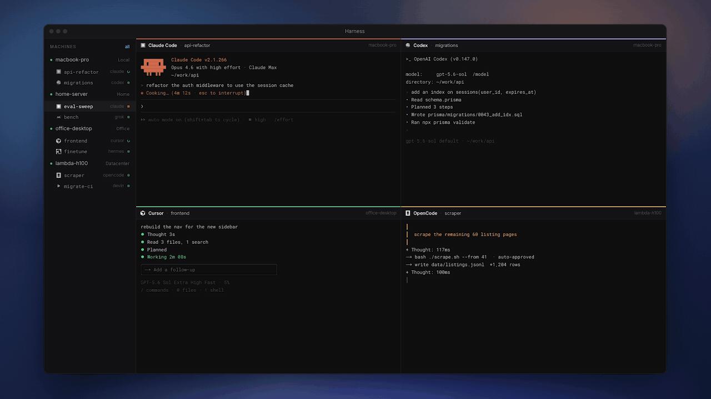
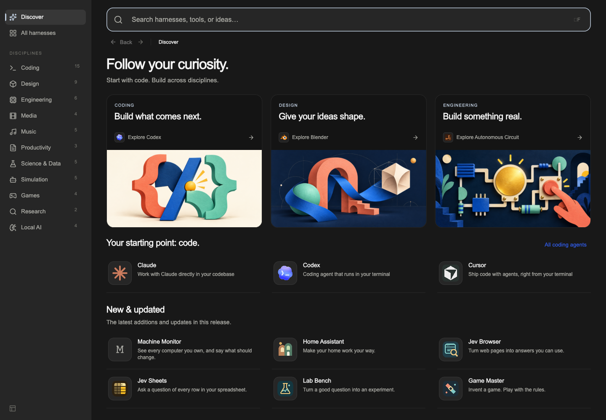
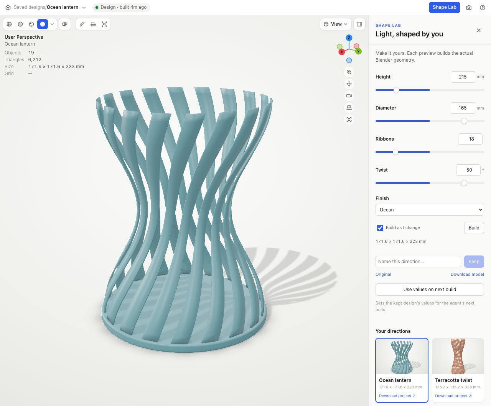
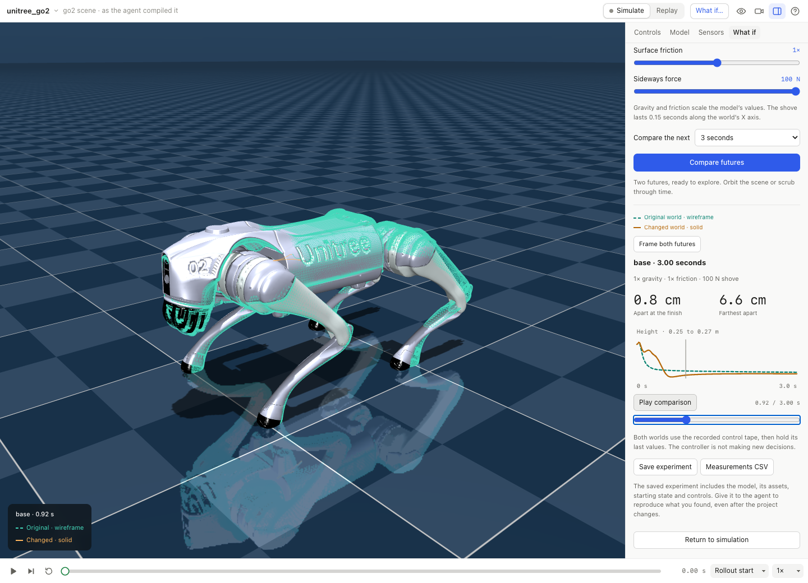
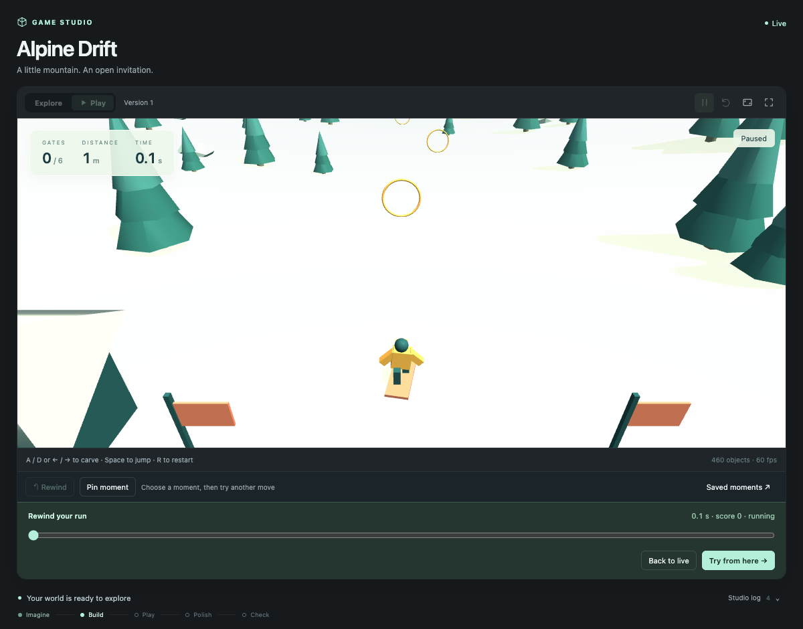
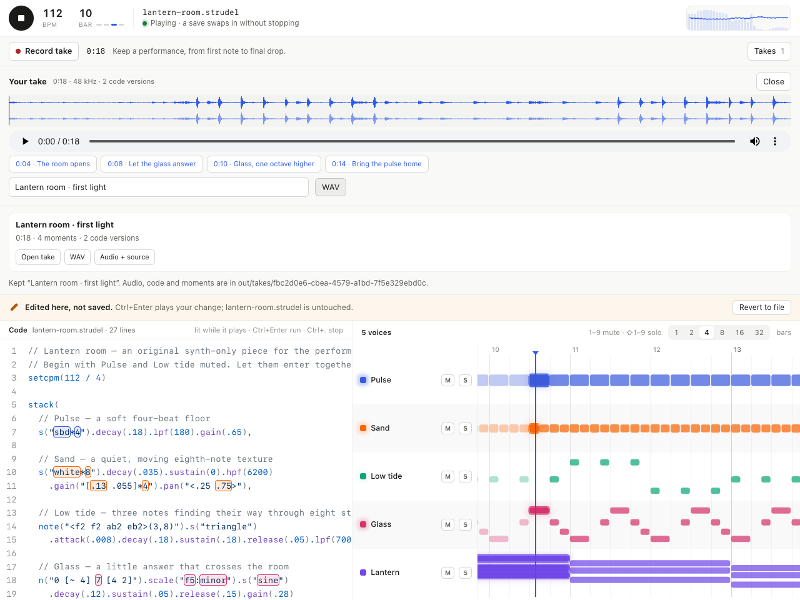
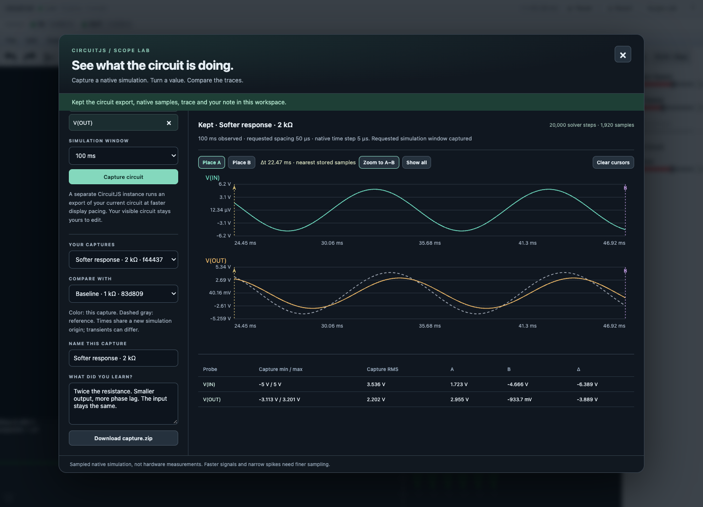
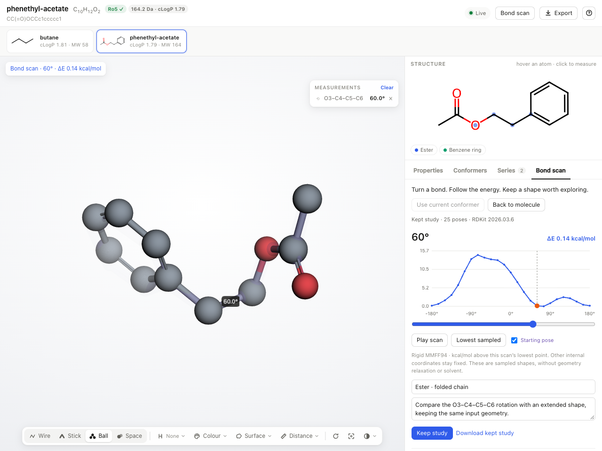
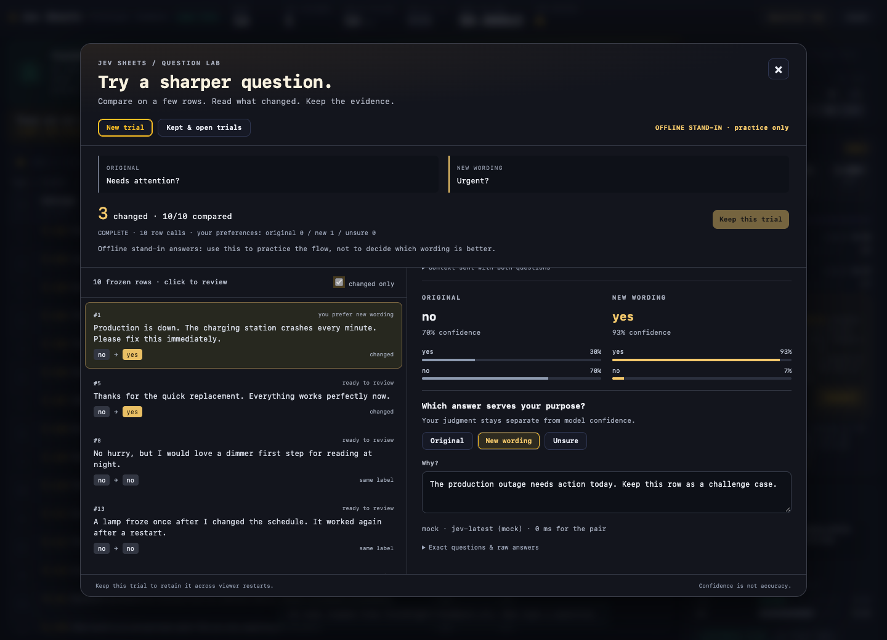
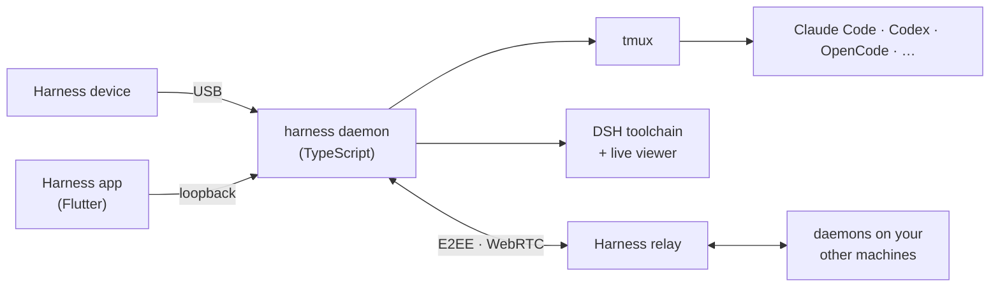

# One workspace for all your coding agents.

OpenHarness brings Claude Code, Codex, and your other coding agents into one open-source workspace.

- **Keyboard first.** Launch, split, search, and switch with a few keystrokes.
- **Multiple machines.** Your laptop, desktop, and servers in one window.
- **Multiple harnesses.** Run different coding agents side by side in persistent terminals.
- **End-to-end encryption.** Remote terminal traffic is encrypted; the relay sees only ciphertext.

[Download the app](https://harness.autonomous.ai/desktop) · [Keybindings](docs/keyboard.md) ·
[Run it](#run-it) · [Beyond coding](#beyond-coding)

<p align="center">
  <a href="https://cdn.autonomous.ai/development/ecm/260910/Thumb-harness-app.mp4"></a>
</p>

## Beyond coding

You already know how to build with code. Take those same skills into CAD, circuits, robotics,
games, music, and science. Give your agent a domain-specific harness, then shape, test, and explore
what it makes in a live viewer.

<p align="center">
  <a href="desktop/design/review/store-discover.png"></a>
</p>

Discover a craft in the Store. Open **Featured** to watch recorded sessions and find something you want to make.

### Get your hands on it

Shape a lamp. Change a robot's world. Rewind a jump. Perform a track. The agent builds with the
tools of a craft; you explore the result, make choices and keep the version you like.

Pick a preview to watch its recording, or **Try it** for a starting prompt and a walkthrough.

<!-- Posters and recording captions are from store/hands-on.json. GitHub video attachments mirror the original MP4s in docs/images/. -->
<table>
  <tr>
    <td width="50%" valign="top">
      <p><strong>Shape a lamp</strong> · Blender</p>
      <a href="https://github.com/user-attachments/assets/dc152a0b-94b6-4324-9d30-468b7ed3d14b"></a>
      <p>Real Blender session · shape a ribbon lamp and keep named design variants</p>
      <p><a href="https://github.com/user-attachments/assets/dc152a0b-94b6-4324-9d30-468b7ed3d14b">▶ Watch session</a> · <a href="docs/hands-on.md#blender-shape-it-until-it-feels-right">Try it</a></p>
    </td>
    <td width="50%" valign="top">
      <p><strong>Change the world</strong> · MuJoCo</p>
      <a href="https://github.com/user-attachments/assets/bc214f57-7967-4e4b-9fe2-b722a033157d"></a>
      <p>Real Go2 session · 100 N shove · compare two futures and keep the experiment</p>
      <p><a href="https://github.com/user-attachments/assets/bc214f57-7967-4e4b-9fe2-b722a033157d">▶ Watch session</a> · <a href="docs/hands-on.md#mujoco-try-a-different-world">Try it</a></p>
    </td>
  </tr>
  <tr>
    <td width="50%" valign="top">
      <p><strong>Rewind a jump</strong> · Godogen</p>
      <a href="https://github.com/user-attachments/assets/ee9e1af9-e92b-4a76-8583-36e2ee7ea4ec"></a>
      <p>Alpine Drift · a real playable run, rewind, retry and saved feedback</p>
      <p><a href="https://github.com/user-attachments/assets/ee9e1af9-e92b-4a76-8583-36e2ee7ea4ec">▶ Watch session</a> · <a href="docs/hands-on.md#godogen-try-that-moment-again">Try it</a></p>
    </td>
    <td width="50%" valign="top">
      <p><strong>Perform a track</strong> · Strudel</p>
      <a href="https://github.com/user-attachments/assets/a3d4381b-5f55-406c-9d68-330cd8792fc5"></a>
      <p>Lantern room · real 112 bpm performance with audio · keep the WAV, source and markers</p>
      <p><a href="https://github.com/user-attachments/assets/a3d4381b-5f55-406c-9d68-330cd8792fc5">▶ Watch session · with audio</a> · <a href="docs/hands-on.md#strudel-perform-the-version-you-love">Try it</a></p>
    </td>
  </tr>
  <tr>
    <td width="50%" valign="top">
      <p><strong>Compare the signal</strong> · CircuitJS</p>
      <a href="https://github.com/user-attachments/assets/6fb1892a-23a2-49ba-9698-4e71a404f1f4"></a>
      <p>Real CircuitJS solver · compare RC filter traces at 1 kΩ and 2 kΩ, measure and keep both</p>
      <p><a href="https://github.com/user-attachments/assets/6fb1892a-23a2-49ba-9698-4e71a404f1f4">▶ Watch session</a> · <a href="docs/hands-on.md#circuitjs-see-what-changed-in-the-signal">Try it</a></p>
    </td>
    <td width="50%" valign="top">
      <p><strong>Turn a molecule</strong> · RDKit</p>
      <a href="https://github.com/user-attachments/assets/a7132b72-db46-4873-b412-ef5c2b400a8e"></a>
      <p>Phenethyl acetate · real rigid MMFF94 bond scan · 25 poses and a kept study</p>
      <p><a href="https://github.com/user-attachments/assets/a7132b72-db46-4873-b412-ef5c2b400a8e">▶ Watch session</a> · <a href="docs/hands-on.md#rdkit-see-a-molecule-turn">Try it</a></p>
    </td>
  </tr>
  <tr>
    <td width="50%" valign="top">
      <p><strong>Review a draft</strong> · Typst</p>
      <a href="https://github.com/user-attachments/assets/603d7d8d-941d-41d1-8a17-5765487aafea"></a>
      <p>Portable light · real Typst PDF · anchored notes carried into a later revision</p>
      <p><a href="https://github.com/user-attachments/assets/603d7d8d-941d-41d1-8a17-5765487aafea">▶ Watch session</a> · <a href="docs/hands-on.md#typst-point-at-what-you-mean">Try it</a></p>
    </td>
    <td width="50%" valign="top">
      <p><strong>Ask a better question</strong> · Jev Sheets</p>
      <a href="https://github.com/user-attachments/assets/afc30e73-2f0a-442e-b929-79126adea76b"></a>
      <p>Offline practice recording · fictional support tickets · paired questions and a kept review</p>
      <p><a href="https://github.com/user-attachments/assets/afc30e73-2f0a-442e-b929-79126adea76b">▶ Watch session</a> · <a href="docs/hands-on.md#jev-sheets-ask-a-better-question">Try it</a></p>
    </td>
  </tr>
</table>

[Explore all eight experiences](docs/hands-on.md) · [Run a native starter](docs/try-hands-on.md)

## For polymaths in the making.

> “World-class entrepreneurs are polymaths.”
>
> — [Peter Thiel](https://www.youtube.com/watch?v=h10kXgTdhNU&t=811s)

The old rule said ten thousand hours to a craft. That was the tax on curiosity, and most of us could
only afford to pay it once, so we specialized and called the rest hobbies.

Coding agents become the specialists, given the tools of a craft and a way to see what they made:
the geometry that becomes a part, the netlist that becomes a circuit board, the script that becomes
a film. You bring the idea, the taste, and the judgment about what is worth making.

Built for the curious engineer who wants to build beyond software. Get your hands on more of what
you are making, from the physical product to the analysis and the launch video. Makers and creators
with the same curiosity are welcome. You get there by directing a specialist in each craft and
judging what comes back, not by mastering them all first.

Monday, a feature. Tuesday, the customer data. Wednesday, an enclosure for the prototype. Thursday,
the launch video. You already know how to build with code, and Harness brings that way of working to
CAD, circuit boards, games, videos, and documents, with agents and tools for each craft.

Your ideas can take you into unfamiliar crafts: an app, a physical product, a game, a film. This is
a place to follow them. Give each job an agent with the right tools, inspect what it makes, and steer
the next iteration. The code and project files are there to read, change, version, and build on.

**From handoff to hands-on.** You bring intent and judgment; your agents write and run code. Each
harness supplies the tools and feedback for a different craft. You can get your hands on more of
the product and the work of bringing it to customers.

Use the desktop app on its own, or add the optional **Harness device** to follow your agents, answer
their questions, and speak new tasks from your desk. The app, firmware, schematics, PCB layouts, and
enclosure CAD files are all open source.

Start with what you know and learn the next craft through the things you build. The
[ideal-user guide](docs/ideal-users.md) records who we're building for and how the app, community,
and device serve them.

## Domain-specific harnesses (DSH)

**Coding agents can build far more than software.** Code is the common medium: geometry scripts make
parts, animation code makes videos, and analysis code turns data into charts and findings. That is
what connects the dots between crafts, and a harness gives the agent the tools and feedback to work
in each one.

A **domain-specific harness** turns a coding agent into a specialist. It brings the domain's
instructions and skills, a pinned toolchain, a project template, a verdict the app can read, and a
**live viewer** for what the agent makes. You chat on one side; the board, the part, the robot or the
game takes shape on the other, and stays interactive after the agent is done.

A DSH is a folder with a `harness.json`. The agent does the reasoning; the harness brings the tools
and the view. Adding a domain never needs a change to the app or the daemon.

<!-- store-catalog:start -->
### Coding and beyond

Start with a coding agent you already use. Explore 49 domain-specific harnesses when your
next idea takes you further.

| Category | Agents and harnesses |
|---|---|
| **Coding** | [Claude Code, Codex, Cursor, OpenCode, Pi, Hermes, Command Code, Devin, Muse Code, Amp, Antigravity, GitHub Copilot, Grok Build, Kilo Code](docs/engines.md), [Harness Monitor](store/agents/harness-monitor/), [Machine Monitor](store/agents/machine-monitor/) |
| Design | [Autonomous Workshop](store/agents/autonomous-workshop/), [Blender](store/agents/blender/), [Bonsai MCP](store/agents/bonsai-mcp/), [Creative Direction](store/agents/creative-direction/), [Excalidraw](store/agents/excalidraw/), [FreeCAD](store/agents/freecad/), [Generative Art](store/agents/generative-art/), [OpenSCAD](store/agents/openscad/), [text-to-cad](store/agents/text-to-cad/) |
| Engineering | [Autonomous Circuit](store/agents/autonomous-circuit/), [CircuitJS](store/agents/circuitjs/), [Home Assistant](store/agents/home-assistant/), [KiCad](store/agents/kicad/), [Orca Slicer](store/agents/orca-slicer/), [Yosys](store/agents/yosys/) |
| Media | [Comfy MCP](store/agents/comfy-mcp/), [Manim](store/agents/manim/), [OpenMontage](store/agents/openmontage/), [Remotion](store/agents/remotion/) |
| Music | [Ableton AI](store/agents/ableton-ai/), [JUCE Agent Toolkit](store/agents/juce-agent-toolkit/), [Music Studio](store/agents/music-studio/), [Score](store/agents/score/), [Strudel](store/agents/strudel/) |
| Productivity | [Jev Sheets](store/agents/jev-sheets/), [Marp](store/agents/marp/), [Typst](store/agents/typst/) |
| Science & Data | [autoresearch-mlx](store/agents/autoresearch-mlx/), [Data Studio](store/agents/data-studio/), [Lab Bench](store/agents/lab-bench/), [marimo](store/agents/marimo/), [RDKit](store/agents/rdkit/) |
| Simulation | [DimOS](store/agents/dimos/), [Drone Pilot](store/agents/drone-pilot/), [Foam-Agent](store/agents/foam-agent/), [MuJoCo](store/agents/mujoco/), [SimSkill](store/agents/simskill/) |
| Games | [Game Master](store/agents/game-master/), [Godogen](store/agents/godogen/), [Phaser](store/agents/phaser/), [Voxel Worlds](store/agents/voxel-worlds/) |
| Research | [Jev Browser](store/agents/jev-browser/), [Roundtable](store/agents/roundtable/) |
| Local AI | [Grid](store/agents/autonomous-grid/), [MLX-LM](store/agents/mlx-lm/), [Ollama](store/agents/ollama/), [vLLM](store/agents/vllm/) |

These are the 49 harnesses currently listed in the Store catalog. They combine upstream
open-source tools and original workflows, with instructions, setup, checks, and live views for each craft.

The 10 [shared viewers](store/viewers/) cover CAD, 3D models, documents, games, film, video,
MuJoCo, web pages, isolated web previews, and studios. Viewer packages install alongside the
harnesses that need them. Experimental packages marked unlisted are not included above.
<!-- store-catalog:end -->

**The harness we'd love to see next is the one for your craft.** Bring an open-source tool you use,
a workflow you know well, or your own company's toolchain. A harness can live in this repository or
in yours.

<details>
<summary>More things made with Harness: circuits, CAD, robots, rooms, games and animation</summary>

<!-- store-showcase:start -->
<p align="center">
  <a href=".github/assets/store/showcase.gif"></a>
</p>

Six real outputs, one at a time. Each slide includes the harness and the original prompt.
[Still preview](.github/assets/store/showcase-poster.png) · Individual images and prompts below.

<details>
<summary>Read the prompts and open individual images</summary>

**[Autonomous Circuit](store/showcase/autonomous-circuit/six-key-macropad.jpg)** · [Open harness](store/agents/autonomous-circuit/)

> Design a six-key USB macropad. Start with the schematic.

**[text-to-cad](store/showcase/text-to-cad/planetary-gear-set.jpg)** · [Open harness](store/agents/text-to-cad/)

> Design a 3D-printable planetary gear set: a 12-tooth sun, three 18-tooth planets and a 48-tooth ring gear with mounting lugs, module 1.5 and 8 mm thick, plus a carrier on steel pins. Give each part its own colour.

**[MuJoCo](store/showcase/mujoco/g1-humanoid-hello.jpg)** · [Open harness](store/agents/mujoco/)

> Make the Unitree G1 humanoid say hello: stand, raise its right hand and wave three times, then lower it and take a small bow. Record it.

**[Blender](store/showcase/blender/cozy-reading-nook.jpg)** · [Open harness](store/agents/blender/)

> Make a cozy isometric reading nook: a cut-away corner of a room with an armchair, a floor lamp glowing warm, a bookshelf full of colourful books, a round rug and a monstera, with evening sun through the window and a cat asleep on the rug.

**[Godogen](store/showcase/godogen/neon-drift.jpg)** · [Open harness](store/agents/godogen/)

> Make a synthwave hoverbike racer: ride down a neon grid canyon toward a striped setting sun, weave between glowing pylons, hop barriers and collect energy cores, with a boost and three shields.

**[Manim](store/showcase/manim/fourier-knight.jpg)** · [Open harness](store/agents/manim/)

> Draw a chess knight using nothing but spinning circles: a Fourier series of 120 epicycles, tip to tail, tracing its silhouette in gold.

</details>
<!-- store-showcase:end -->

Every picture in this slideshow is output from the harness's own toolchain, with its original prompt.

</details>

## Run it

1. [Download the desktop app](https://harness.autonomous.ai/desktop) for macOS or Linux.
2. Sign in to a coding agent you already use, with your own subscription, API key, or local model.
3. Press **⌘N**, pick an agent or a harness, a machine and a project, and start.

On another machine:

```bash
curl -fsSL https://harness.autonomous.ai/cli/install.sh | bash
harness login
harness start
```

Then **Machines → Link Machine** in the app.

macOS is the primary tested platform. Linux builds exist and feature parity is in progress; Windows is
work in progress. Embedded live viewers require macOS; remote viewers also need a current Harness
CLI on both machines. The app and daemon still need a Harness account to start;
[account-free local use is tracked](docs/development.md#account-free-local-use).

<details>
<summary><b>Build from source</b></summary>

For macOS, install Node.js 20+, tmux, Xcode, and Flutter 3.47+ / Dart 3.13+:

```bash
git clone https://github.com/autonomous-ai/openharness.git
cd openharness
(cd cli && npm ci)
make install-cli
cd desktop
flutter config --enable-swift-package-manager
flutter pub get
flutter run -d macos
```

`make install-cli` installs this checkout's CLI and restarts the local daemon. The
[development guide](docs/development.md) covers tests and isolated environments.

</details>

### How it fits together



The [architecture guide](docs/architecture.md) covers the daemon, the session model, transport and
encryption.

## Your first DSH in ten minutes

The [Hello World example](store/examples/hello-world/) is a Codex session that edits an HTML page
shown in the shared Web Viewer:

```text
hello-world/
  harness.json
  AGENTS.md             # instructions for the agent
  template/index.html   # copied into a new project
```

Its manifest connects the pieces:

```json
{
  "spec": 1,
  "id": "examples/hello-world",
  "name": "Hello World",
  "engine": "codex",
  "workspace": {
    "template": "template",
    "marker": "index.html"
  },
  "agent": { "instructions": "AGENTS.md" },
  "viewer": { "use": "autonomous/web-viewer" }
}
```

The CLI and the package protocol call a harness a DSH, so the commands are `harness dsh …`. From this
checkout, with the `harness` CLI installed:

```bash
harness dsh install "$PWD/store/viewers/web-viewer" --link
cp -R store/examples/hello-world ../my-first-harness
harness dsh check ../my-first-harness
harness dsh install ../my-first-harness --link
```

Press **⌘N → Hello World**, choose a new project, and ask it to “Say hello to Ada.” The agent edits
`index.html`; the viewer reloads. Change `AGENTS.md` to try another workflow, then start a new session.
`--link` keeps the package connected to your source directory; Store installs resolve viewer
dependencies on their own.

The [authoring guide](store/README.md) covers the full manifest, toolchains, live progress, verdicts,
store pages, and publishing; the [package specification](store/spec/README.md) is the contract.

| Piece | Responsibility |
|---|---|
| Engine | Runs the coding agent: Claude Code, Codex, OpenCode, and the rest |
| Harness (DSH) | Packages a domain: engine, instructions, toolchain, workspace, and viewer |
| Viewer | Shows and interacts with what the agent makes; shared across harnesses |
| Session | One running agent, in one project, on one machine |

## Harness device

<p align="center">
  
</p>

The optional **Harness device** is a round, always-on display that sits beside
your keyboard and shows your agents at a glance: what each one is doing, which one has finished, and
which one is waiting on you. Read a question and answer it on the screen, or tap and speak a new task,
without switching windows.

It is open hardware, all the way down. This repository has everything it takes to build one:

| Layer | What's here |
|---|---|
| [Firmware](devices/harness-device/firmware/) | ESP32-S3, ESP-IDF, a 466 × 466 round AMOLED with touch, microphones and audio. Connects to the host's daemon over USB — no Wi-Fi setup, no account on the device. |
| [PCB](devices/harness-device/hardware/pcb/) | The EasyEDA Pro project, the schematic, Gerbers, the bill of materials, and pick-and-place data for assembly. |
| [Enclosure](devices/harness-device/hardware/3d/) | STEP for editing and STL for printing: the housing, an iron counterweight base, the USB clamp, and the button. |

[**Get a Harness device**](https://www.autonomous.ai/harness), or build your own from these files. The
[firmware guide](devices/harness-device/firmware/README.md) lists the supported boards and build
commands, and the [hardware guide](devices/harness-device/hardware/README.md) covers the design files.

https://github.com/user-attachments/assets/97848065-61c6-40df-be66-a8247f69aa4c

## Contributing

There are three ways in, one for each layer of the stack.

- **Make a DSH for a tool you use.** Start from Hello World, make one workflow work end to end, pin the
  toolchain, credit the upstream project, and show something worth looking at in the viewer.
- **Improve the coding workspace.** Terminal behavior, engine support, the daemon, the relay, Linux and
  Windows.
- **Hack the hardware.** Port the firmware to another board, remix the enclosure, add a feature to the
  device.

Small fixes and notes about something that didn't work are welcome too. The
[contribution guide](CONTRIBUTING.md) walks through each path.

## Repository map

```text
desktop/    Flutter app and terminal workspace
cli/        TypeScript CLI, daemon, engine adapters, and package runtime
backend/    Relay and control plane
store/      Domain-specific harnesses, shared viewers, registry, examples, and package spec
provider/   Provider API contract, implementations, and conformance tests
devices/    Harness device firmware, PCB, and enclosure
```

- [Development and testing](docs/development.md) · [Extension points](docs/extending.md) · [CLI and automation](docs/cli.md)
- [Desktop](desktop/README.md) · [Daemon](cli/README.md) · [Relay](backend/README.md) · [Provider API](provider/README.md)
- [Security policy](SECURITY.md) · [License](LICENSE)

The repository is MIT licensed unless a folder says otherwise. Upstream tools, models, and assets keep
their own licenses.
