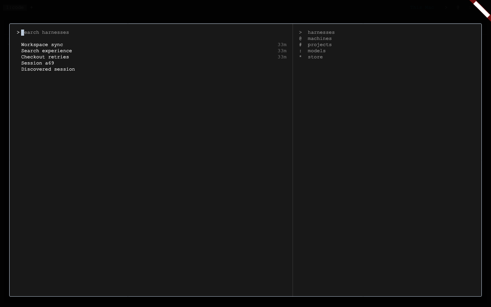
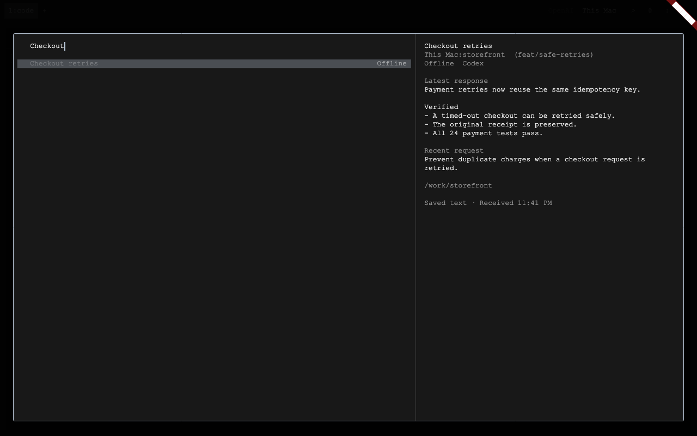
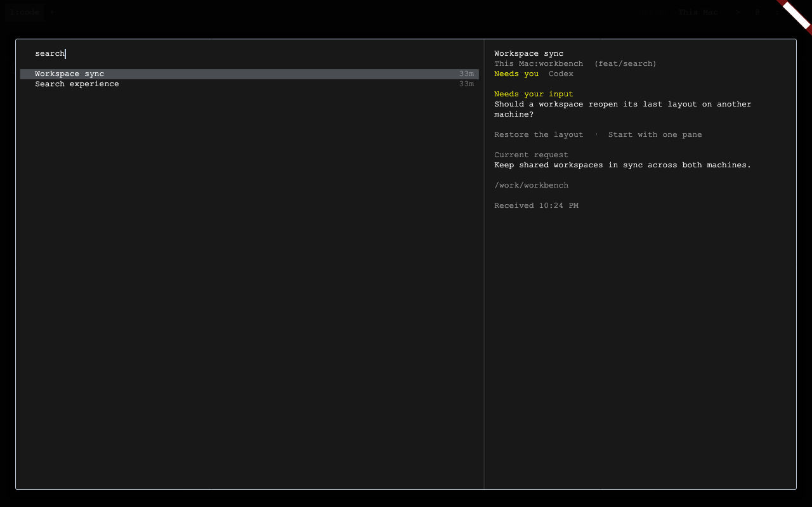
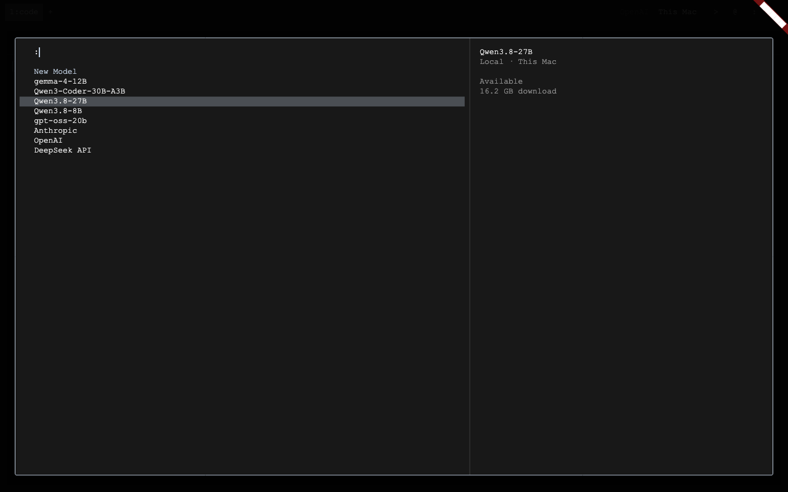
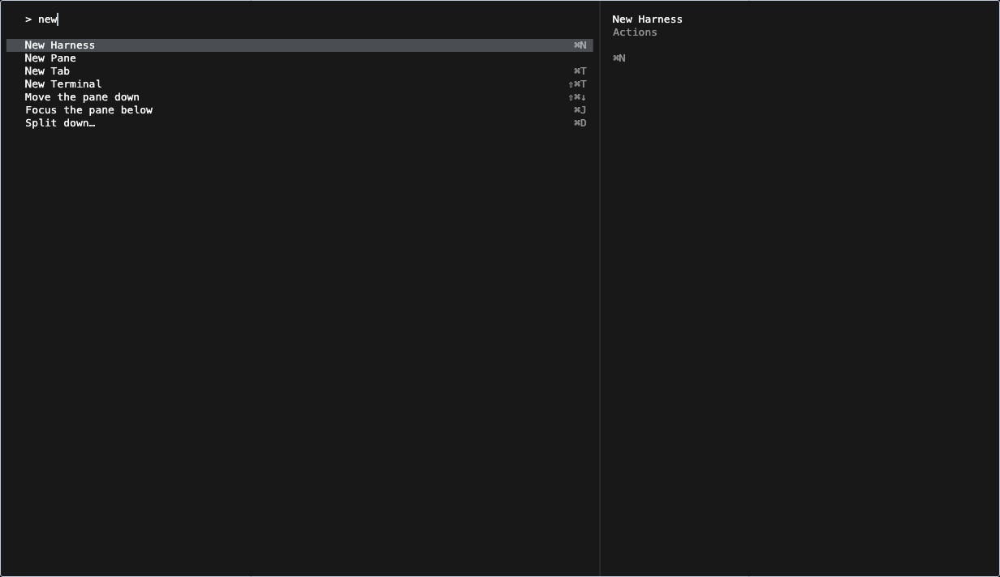
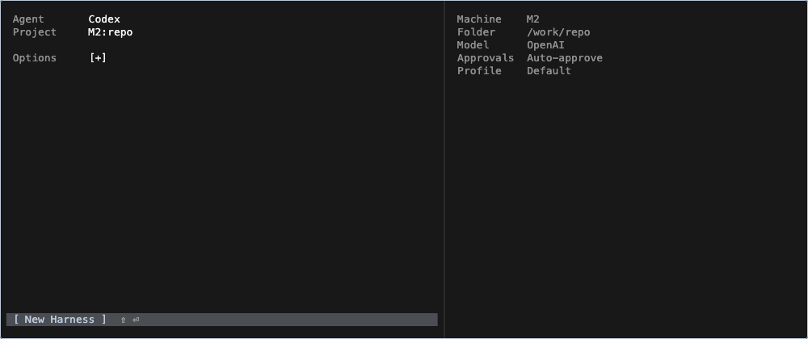

# Terminal dialog design system

**Fixed cells. Plain text. One-line selection.**

This is the dialog chapter of the [terminal workspace design system](terminal-workspace.md).

Harness's terminal-workspace dialogs should feel like part of the terminal.
This is the agreed design direction from the Cmd-N and Cmd-P review on
2026-09-24. Apply it to new and revised workspace pickers, forms, confirmations,
and their previews. It is the current source of truth for their presentation,
including where older design handoffs describe different visuals.

Cmd-N (`NewHarnessForm`) and Cmd-O (`SwarmSearchResults` in its terminal setup
layout) are the implementation references. Full Settings pages and embedded
viewers keep their own component systems.



The fixture above shows the terminal grid, plain-text rows, and unselected
opening state. Live surfaces use the user's selected terminal font and palette.

## Lay out a character grid

Measure the selected terminal font through `terminalCellSizeOf(context)` in
[`terminal_text.dart`](../lib/terminal/terminal_text.dart). Its width is one
character column; its height is one text row. Use this shared measurement in
both layout and scrolling calculations.

- Express horizontal margins, gutters, column widths, and gaps in whole cells.
- Express vertical spacing in whole text rows. A title is one row; its context
  or description is the next row; separation is a blank row.
- Align the input text, result titles, and context lines to the same column.
  Align form labels and values in consistent columns.
- Keep single-line choices to one row. Truncate long labels within their
  column; preserve the full value for accessibility or inspection.
- On narrow windows, reduce columns or change the pane arrangement. Keep the
  measured font and row spacing rather than shrinking text to fit.

Do not approximate a cell as `fontSize * .6`, copy pixel padding from a
screenshot, or let Material control minimum heights determine the grid.

```dart
final cell = terminalCellSizeOf(context);
final gutter = cell.width * 2;
final lineHeight = cell.height;
```

## Highlight one line

The selection background spans the selected name/value line and is exactly one
terminal row tall. Descriptions, metadata, previews, and blank spacing remain
outside it. Only the list or field that owns keyboard navigation shows the
active highlight. Moving selection must not shift any text or columns.

Click targets may include a result's context line. Their size must not enlarge
the visible selection. Keep semantic selection, focus, and enabled state even
when using custom row widgets.

## Use text for the controls

- No provider logos, avatars, decorative emoji, image assets, or icon-font
  glyphs in dialog chrome. Write `Codex`, `Claude`, or the harness name.
- Keep Cmd-O and Cmd-P search prefixes editable: Cmd-P opens an empty field and
  Cmd-O inserts `#`. Deleting a prefix returns to harness search.
  Do not draw a separate prompt character beside these inputs.
- All Cmd-P results occupy one row: title
  on the left and activity age, when available, on the right. Machine, project,
  model, API connection, and Store details live in the preview. For sessions,
  the preview puts the compact
  Standard context `machine:project  (branch)` directly below the session title,
  followed by status and harness type. Omit missing fields and preserve
  important state such as Offline.
- Boolean controls use `[x]` and `[ ]`; Enter and Space toggle them.
- Actions use concise text, such as `[ New Harness ]`. Shortcut hints are text
  beside the action, resolved from the live keymap.
- Omit redundant heading rows such as “New Tab” or “New Pane.” Add a label or
  explanation only when it helps someone understand a choice or state.
- Preserve user content, including Unicode. The restriction on decorative
  graphics applies to our controls, not to the text someone supplied.

For example, Cmd-P session results are consecutive single lines:

```text
  Search harnesses

  Checkout retries                         5m
  Search experience                        1h
```

The highlight covers the selected row. All result types, including resource
creation entries, use consecutive single lines. Details remain searchable and
available to screen readers. Machine and project previews retain their name
and harness count even when they contain just one session.

Unavailable sessions keep their place in the list. Dim their names and replace
the activity age with a short reason such as `Offline`, `Not connected`, or
`Link required`. They remain selectable for their saved preview, but Enter and
click cannot open them. Availability updates in place when the machine reconnects.







## Inherit the real terminal's appearance

Use `terminalContentStyle()` for all dialog text: input, labels, values,
metadata, timestamps, actions, and previews. This preserves the terminal's
font family, fallback fonts, size, line height, and zero added letter/word
spacing. Do not substitute the general app UI type scale or hardcode a font
and size in an individual dialog.

Resolve colors through `terminalThemeFor(AppTheme.palette.value,
terminalThemeStore.value)` from
[`terminal_theme.dart`](../lib/terminal/terminal_theme.dart). Use its background,
foreground, cursor, selection, and semantic colors. Derive muted text from its
foreground; hardcoded white fails on other terminal schemes.

Use the same thin frame as an active pane:
`terminalPaneBorder(focused: true)` and `kTerminalCornerRadius` from
[`box_chrome.dart`](../lib/widgets/box_chrome.dart). Keep the surface flat, with
no elevated cards, pill controls, or decorative shadows inside it.

Cmd-O and Cmd-P use one unfilled, borderless text line with a thin, two-pixel caret.
Align its editable text with the result titles. Previews use the same text
metrics and blank-row spacing; warnings are readable text in semantic colors.

Cmd-P opens with no selected row. The preview area shows the type hints as plain,
muted text: `@ machines`, `# projects`, `: models`,
`* store`, and `> commands`.
Typing selects the first match and replaces the hints with its preview. Arrows,
Tab, and pointer movement can also select a row. Clearing the root search returns
to the hints; live inventory updates must not choose a row for the user. Enter
does nothing until a row is selected. Keep the input and list in place throughout.
Cmd-P has no New Harness row, including in machine and project session lists.
Cmd-N opens creation. Resource setup rows use general guidance rather than
presumed defaults.
Page Up/Down pages the result list; Shift-Up/Down scrolls the preview by one
measured terminal row. These keys preserve the input's focus and query. Preview
scrolling keeps the selected result and result-list scroll position unchanged.

Cmd-Shift-P opens this same picker with editable `>` text. Commands and `?` help
keep the same input, frame, terminal metrics, and two-pane arrangement as Cmd-P;
changing a prefix must not replace the editor or move it. Command names occupy
one row with their live shortcut aligned right. The preview shows the selected
command's name, category, and shortcut, without session-text placeholders. Empty
matches clear the preview. Omit the older title/count row and key-hint footer.



Open dialogs must follow live terminal font and theme changes while preserving
the input controller, query, selection, focus, and scroll state. Wire the font,
palette, and terminal-theme dependencies as the reference dialogs do. Settings
come from Harness's own Terminal preferences, not Apple Terminal or iTerm.

## Keep the terminal interaction

Cmd-N opens with **Agent**, **Project**, **Options**, and the selected
`[ New Harness ]` action. Enter launches with the displayed settings. Options
starts collapsed on a fresh draft and expands Model, Branch, Worktree,
Approvals, and Profile in place. Keep Worktree as `[x]` / `[ ]`.



The right pane shows the resolved machine, full folder, model, and applicable
Git and agent settings. Enter or typing on a field replaces that summary with
its searchable choices; accepting a value restores the summary. Narrow windows
show the active choices in place of the form. No permanent Machine field or
additional top-level Harness field.

Agent offers Codex, Claude Code, Terminal, and specialized harnesses together.
A direct agent completes the choice. A specialized harness such as Blender
opens `Run Blender with` in the same pane, offering compatible coding agents
with its remembered choice selected. The left value then reads
`Blender · Codex`.

Project searches existing `machine:project` pairs across the inventory; names,
machine names, and paths are searchable. Put local projects first before a
search, and dim unavailable destinations with a short reason. Selecting a
project commits both its machine and folder. New Folder, Open Folder, and Clone
Repository first ask for a machine (local selected), then a name, path/browser,
or repository URL. Escape retraces these steps. Searching or moving the
highlight never creates a folder or starts a harness.

Arrows navigate the active choices; Enter accepts the current choice; Escape
goes back or dismisses according to the existing workflow. An editor still
accepts ordinary text, including `j` and `k`. Preserve composition, paste,
readline editing, remapped shortcuts, and mouse access.

Opening, searching, previewing, and cancelling must not send input to an agent,
start a process, or resize/recreate the underlying terminal. Return focus to the
workspace on dismissal. Search navigation should keep typing focus in its
editor, and a stationary pointer must not steal the keyboard highlight.

Keep lists virtualized and retain cached row controls. Arrow movement updates
the old and new highlights; it should not rebuild the editor or whole catalog.
Calculate reveal and paging from the actual measured item extent.

## Review a dialog change

Check the result with the user's terminal font and colors, an alternate scheme,
enlarged text, and a narrow window. Look for a one-line highlight, aligned
columns, intact text, plain controls, and no layout jumps. Exercise typing,
selection, acceptance, dismissal, scrolling, and focus restoration. Check live
font/theme changes while the dialog is open.

Reuse the relevant existing checks:

- [`new_harness_grid_test.dart`](../test/new_harness_grid_test.dart): row and
  column alignment, selection ownership, and scaling.
- [`open_picker_rendering_test.dart`](../test/open_picker_rendering_test.dart):
  pane/dialog appearance, one-line selection, no logos, and virtualized traversal.
- [`swarm_search_render_test.dart`](../test/swarm_search_render_test.dart):
  cached rows, query updates, theme changes, and focus.
- [`swarm_search_preview_test.dart`](../test/swarm_search_preview_test.dart):
  preview navigation and narrow layouts.
- [`keymap_runtime_test.dart`](../test/keymap_runtime_test.dart): shortcut
  routing and focus ownership.

When checking a native build, restart into the rebuilt app before judging the
result. An existing process does not pick up a new build automatically.
