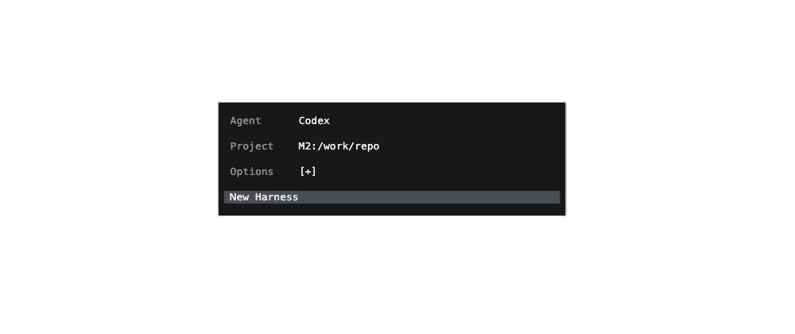
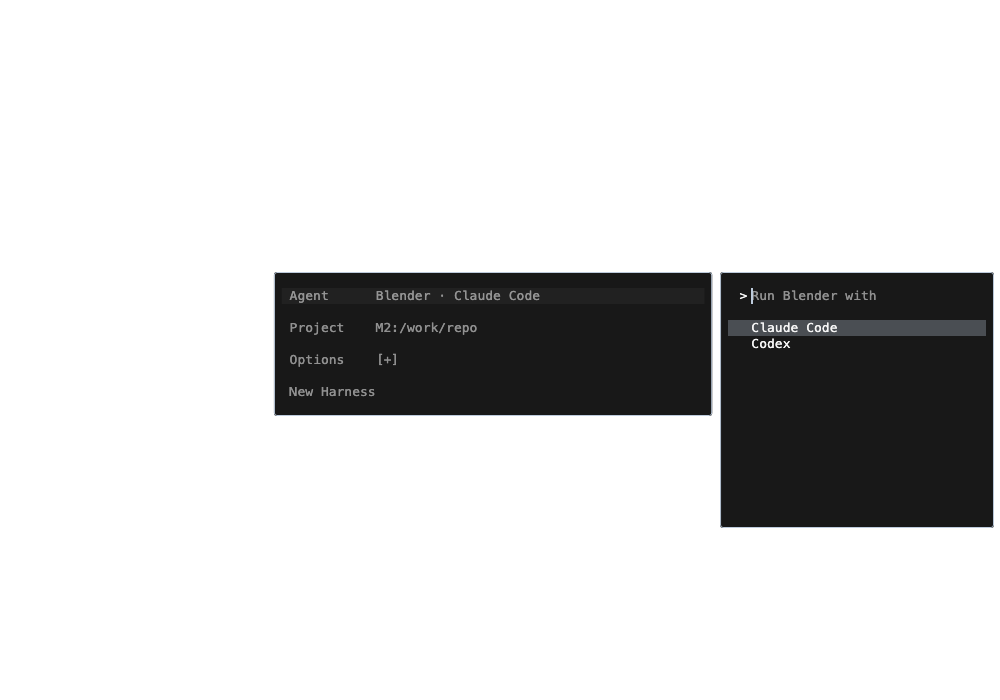

# Terminal dialog design system

**Fixed cells. Plain text. One-line selection.**

This is the dialog chapter of the [terminal workspace design system](terminal-workspace.md).

Harness's terminal-workspace dialogs should feel like part of the terminal.
This is the agreed design direction from the Cmd-N and Cmd-P review on
2026-09-24. Apply it to new and revised workspace pickers, forms, confirmations,
and their previews. It is the current source of truth for their presentation,
including where older design handoffs describe different visuals.

Cmd-N (`NewHarnessForm`) and Cmd-O (`SwarmSearchResults` in its terminal setup
layout) are the implementation references. Full Settings pages and embedded
viewers keep their own component systems.


The fixture above shows the terminal grid, plain-text rows, and unselected
opening state. Live surfaces use the user's selected terminal font and palette.

## Lay out a character grid

Measure the selected terminal font through `terminalCellSizeOf(context)` in
[`terminal_text.dart`](../lib/terminal/terminal_text.dart). Its width is one
character column; its height is one text row. Use this shared measurement in
both layout and scrolling calculations.

- Express horizontal margins, gutters, column widths, and gaps in whole cells.
- Express vertical spacing in whole text rows. A title is one row; its context
  or description is the next row; separation is a blank row.
- Align the input text, result titles, and context lines to the same column.
  Align form labels and values in consistent columns.
- Keep single-line choices to one row. Truncate long labels within their
  column; preserve the full value for accessibility or inspection.
- On narrow windows, reduce columns or change the pane arrangement. Keep the
  measured font and row spacing rather than shrinking text to fit.

Do not approximate a cell as `fontSize * .6`, copy pixel padding from a
screenshot, or let Material control minimum heights determine the grid.

```dart
final cell = terminalCellSizeOf(context);
final gutter = cell.width * 2;
final lineHeight = cell.height;
```

## Highlight one line

The selection background spans the selected name/value line and is exactly one
terminal row tall. Descriptions, metadata, previews, and blank spacing remain
outside it. Only the list or field that owns keyboard navigation shows the
active highlight. Moving selection must not shift any text or columns.

Click targets may include a result's context line. Their size must not enlarge
the visible selection. Keep semantic selection, focus, and enabled state even
when using custom row widgets.

## Use text for the controls

- No provider logos, avatars, decorative emoji, image assets, or icon-font
  glyphs in dialog chrome. Write `Codex`, `Claude`, or the harness name.
- Keep Cmd-O and Cmd-P search prefixes editable: Cmd-P opens an empty field and
  Cmd-O inserts `#`. Deleting a prefix returns to harness search.
  Do not draw a separate prompt character beside these inputs.
- All Cmd-P results occupy one row: title
  on the left and activity age, when available, on the right. Machine, project,
  model, API connection, and Store details live in the preview. For sessions,
  the preview puts the compact
  Standard context `machine:project  (branch)` directly below the session title,
  followed by status and harness type. Omit missing fields and preserve
  important state such as Offline.
- Boolean controls use `[x]` and `[ ]`; Enter and Space toggle them.
- Menu actions use concise text, such as `New Harness`, with the same row
  highlight as other choices and no surrounding brackets. Shortcut hints,
  when needed, are text beside the action, resolved from the live keymap.
- Omit redundant heading rows such as “New Tab” or “New Pane.” Add a label or
  explanation only when it helps someone understand a choice or state.
- Preserve user content, including Unicode. The restriction on decorative
  graphics applies to our controls, not to the text someone supplied.

For example, Cmd-P session results are consecutive single lines:

```text
  Search harnesses

  Checkout retries                         5m
  Search experience                        1h
```

The highlight covers the selected row. All result types, including resource
creation entries, use consecutive single lines. Details remain searchable and
available to screen readers. Machine and project previews retain their name
and harness count even when they contain just one session.

Unavailable sessions keep their place in the list. Dim their names and replace
the activity age with a short reason such as `Offline`, `Not connected`, or
`Link required`. They remain selectable for their saved preview, but Enter and
click cannot open them. Availability updates in place when the machine reconnects.


## Inherit the real terminal's appearance

Use `terminalContentStyle()` for all dialog text: input, labels, values,
metadata, timestamps, actions, and previews. This preserves the terminal's
font family, fallback fonts, size, line height, and zero added letter/word
spacing. Do not substitute the general app UI type scale or hardcode a font
and size in an individual dialog.

Resolve colors through `terminalThemeFor(AppTheme.palette.value,
terminalThemeStore.value)` from
[`terminal_theme.dart`](../lib/terminal/terminal_theme.dart). Use its background,
foreground, cursor, selection, and semantic colors. Derive muted text from its
foreground; hardcoded white fails on other terminal schemes.

Use the same thin frame as an active pane:
`terminalPaneBorder(focused: true)` and `kTerminalCornerRadius` from
[`box_chrome.dart`](../lib/widgets/box_chrome.dart). Keep the surface flat, with
no elevated cards, pill controls, or decorative shadows inside it.

Cmd-O and Cmd-P use one unfilled, borderless text line with a thin, two-pixel caret.
Align its editable text with the result titles. Previews use the same text
metrics and blank-row spacing; warnings are readable text in semantic colors.

Cmd-P opens with no selected row. The preview area shows the type hints as plain,
muted text: `@ machines`, `# projects`, `: models`,
`* store`, and `> commands`.
Each hint is also a plain-text button: clicking it inserts the prefix into the
same editor and keeps typing focus there. Selected harnesses open with Enter.
Machines use Enter to **Manage**: focus moves to their controls without invoking
one. Models use four sections: **Subscriptions**, **APIs**, **Your local AI
models**, and **Shared with you**. Headers are plain muted text and never take
selection. Put **[ Add ]** within APIs. Your local AI models puts downloaded
models first, followed by models served on the user's machines. Keep the
undownloaded catalog collapsed behind **[ Get models ]**; Enter expands it in
place and selects the first catalog row. **[ Hide catalog ]** collapses it.
Explicit searches also include matching catalog models. Shared rows show only
the model and sharing machine's label, separated by ` · `. Filtering preserves
the groups.

A plain right-aligned **Use** identifies a model the current pane can use;
**Get** identifies a model that can be downloaded. Other model rows are dimmed,
remain selectable for inspection, and have no action badge. Enter does nothing
on these rows; it must never silently become Manage. Show the reason in the
preview when it helps. Subscription names include the account label; only an
account compatible with the current harness and available on its machine can
say Use. Include actionable labels in accessibility text.

From a live harness, both Cmd-I and Cmd-P's model scope use Enter to **Use** a
served model, installed local model, or compatible subscription. Starting
installed weights happens once; progress stays in the picker, and the pane
switches only when the model is served. Closing the picker cancels the pending
switch while startup continues on its host. **Get** prepares an undownloaded
model on its host and stays in the picker. Pin selection to the pane that
opened it; changing focus must never switch another pane's model.

Cmd-N, Cmd-P, and Cmd-I share pane navigation: **Tab/Shift-Tab switch between
the left and right panes**, without selecting a value or running an action.
**Up/Down move within the active pane**: fields or choices in Cmd-N, results or
controls in Cmd-P. **Enter activates the highlighted item**. In Cmd-N, Enter
on a field opens its choices; Enter on a choice applies it and selects New
Harness. Tab returns to the same field without applying a choice. In Cmd-P, Enter on a usable model
uses it, on a Get row gets it, on a machine enters management, and on a harness
opens it. Arrow keys walk controls while the right pane owns focus; they must
not change the resource behind them. Left/Right retain normal cursor movement
in text fields, and move between adjacent buttons. Enter/Space activate focused
buttons. Escape backs out of an inline form, then returns to search while
preserving the query and selection. Hints use the live keymap. Only the active
pane shows a selection highlight.
Typing selects the first match and replaces the hints with its preview. Arrows
and pointer movement can also select a row. A pointer cannot change the resource
while its management controls own keyboard focus. Clearing the root search returns
to the hints; live inventory updates must not choose a row for the user. Enter
does nothing until a row is selected. Keep the input and list in place throughout.
Cmd-P has no New Harness row, including in machine and project session lists.
Cmd-N opens creation. Resource setup rows use general guidance rather than
presumed defaults.
Page Up/Down pages the result list; Shift-Up/Down scrolls the preview by one
measured terminal row. These keys preserve the input's focus and query. Preview
scrolling keeps the selected result and result-list scroll position unchanged.

Cmd-Shift-P opens this same picker with editable `>` text. Commands and `?` help
keep the same input, frame, terminal metrics, and two-pane arrangement as Cmd-P;
changing a prefix must not replace the editor or move it. Command names occupy
one row with their live shortcut aligned right. The preview shows the selected
command's name, category, and shortcut, without session-text placeholders. Empty
matches clear the preview. Omit the older title/count row and key-hint footer.


Open dialogs must follow live terminal font and theme changes while preserving
the input controller, query, selection, focus, and scroll state. Wire the font,
palette, and terminal-theme dependencies as the reference dialogs do. Settings
come from Harness's own Terminal preferences, not Apple Terminal or iTerm.

## Keep the terminal interaction

Cmd-N opens a compact, centered key/value form with Agent, Project, collapsed
Options, and `New Harness` selected. Enter launches with the displayed
settings. Options expands Model, Approvals, applicable Profile, Branch, and Worktree
as consecutive rows without internal blank rows. Machine is selected with Project. Keep a blank row between Agent and Project and before Options.
Worktree uses `[x]` / `[ ]`. There is no duplicate summary pane.
Project shows the committed machine and full path, such as
`M2:~/code/autonomous-harness`. Browsing the chooser never changes this value
until a choice is accepted.



Reserve nine columns for labels and two blank columns before values. The launch
action follows the last visible field with exactly one blank row; never pin it
to the bottom with a flexible spacer. The form and chooser use whole character
columns and rows. The form fits its visible rows, stays centered, and keeps its
geometry when choices appear beside it. The chooser starts directly with its search line;
omit a redundant back/title row such as `< Agent`.

Up/Down selects a field and automatically reveals its small chooser to the
right. Navigation still belongs to the form. Right, typing, or Enter moves
focus into the chooser; then Up/Down moves its choices. Enter accepts a value,
closes the chooser, and selects New Harness, ready for the next Enter to launch.
A held Enter must not accept and launch in one keypress. Escape discards the
search and returns to the form in one step; Left also returns when the search
is empty. Nested project and specialized-agent steps retrace their choices.
On narrow windows, the active chooser replaces the form on the same column with
enough rows for its list. Returning restores the compact form. Validation messages
get whole rows of their own so neither the explanation nor the choices are clipped.

Fresh Cmd-N uses the last successfully launched agent, the last used project
on the local machine, the local machine, branch `main`, and Worktree Yes for a
Git project. Model shows the selected model name, or OpenAI / Anthropic when
the subscription agent has not reported a model. Approvals starts at Auto-approve.
Focused panes and canceled edits do not change these defaults; unresolved
launch receipts remain recoverable. An explicit split can inherit its source.
If a required value is unavailable or uncertain, explain it and require a
choice. Never substitute another branch, project, agent, or profile, or turn
Worktree off after a worktree creation failure.

Agent offers Codex, Claude Code, Terminal, and specialized harnesses together.
Keep agent choices to one line. A direct agent completes the choice. A specialized harness such as Blender
uses `Run Blender with` as the search hint, offering compatible coding agents
with its remembered choice selected. The Agent value then reads
`Blender · Codex`.



Project searches existing `machine:project` pairs across the inventory; names,
machine names, and paths are searchable. Put local projects first before a
search, and dim unavailable destinations with a short reason. Selecting a
project commits both its machine and folder. New Folder, Open Folder, and Clone
Repository first ask for a machine (local selected), then a name, path/browser,
or repository URL. Escape retraces these steps. Searching or moving the
highlight never creates a folder or starts a harness.

Arrows navigate the active choices; Enter accepts the current choice; Escape
goes back or dismisses according to the existing workflow. An editor still
accepts ordinary text, including `j` and `k`. Preserve composition, paste,
readline editing, remapped shortcuts, and mouse access.

Opening, searching, previewing, and cancelling must not send input to an agent,
start a process, or resize/recreate the underlying terminal. Return focus to the
workspace on dismissal. Search navigation should keep typing focus in its
editor, and a stationary pointer must not steal the keyboard highlight.

Keep lists virtualized and retain cached row controls. Arrow movement updates
the old and new highlights; it should not rebuild the editor or whole catalog.
Calculate reveal and paging from the actual measured item extent.

## Review a dialog change

Check the result with the user's terminal font and colors, an alternate scheme,
enlarged text, and a narrow window. Look for a one-line highlight, aligned
columns, intact text, plain controls, and no layout jumps. Exercise typing,
selection, acceptance, dismissal, scrolling, and focus restoration. Check live
font/theme changes while the dialog is open.

Reuse the relevant existing checks:

- [`new_harness_grid_test.dart`](../test/new_harness_grid_test.dart): row and
  column alignment, selection ownership, and scaling.
- [`open_picker_rendering_test.dart`](../test/open_picker_rendering_test.dart):
  pane/dialog appearance, one-line selection, no logos, and virtualized traversal.
- [`swarm_search_render_test.dart`](../test/swarm_search_render_test.dart):
  cached rows, query updates, theme changes, and focus.
- [`swarm_search_preview_test.dart`](../test/swarm_search_preview_test.dart):
  preview navigation and narrow layouts.
- [`keymap_runtime_test.dart`](../test/keymap_runtime_test.dart): shortcut
  routing and focus ownership.

When checking a native build, restart into the rebuilt app before judging the
result. An existing process does not pick up a new build automatically.

## Manage machines and models inside Cmd-P

Place compact facts and controls together at the top of the preview. This
computer has `[ Password ] [ Rename ]`; remote machines have `[ Connect ]
[ Rename ] [ Delete ]`, with Connect only when linking is needed. Password opens
the password form alone. Delete retains the account-removal confirmation. Show
connection state, harness count, and real CPU/RAM readings; refresh resource
readings while the machine picker is visible and the app is in the foreground.
Do not add a View harnesses, Linked machines, Refresh, or Actions button to this
management pane. Keep the controls on one row, wrapping only when needed.

Connect, Rename, Password, and Delete edit or confirm **inside the right pane**;
never cover Cmd-P with a second dialog. Keep the search and machine list in
place. Cancel/Escape returns to the selected machine's controls. Pending
operations survive closing their editor, and errors stay beside the fields.
Deletion and password clearing start with Cancel focused.

With no machine name typed, order machines by the next useful action: online
machines needing a connection, this computer, other connected machines, then
offline machines. Sort names naturally within each group. A live status change
may reorder rows but must preserve the selected machine's identity. Typed
queries retain match relevance. Put **Add machine** after the machine rows.
It explains installation on the other computer, sign-in to the same account,
and setting its password. App and CLI open their setup instructions in the
same right pane; copying CLI commands never executes them on this computer.

Local models show their name with quantization once, host and model-file size,
and measured tokens/sec and request count with its period when available.
Include inventory from every connected, linked machine in the account. Resolve
Grid hostnames through the hostname on the Harness machine record, then use
that machine's own model IDs and capabilities for controls. Display its Harness
name (for example, M2), and keep its Grid hostname (mac.lan) searchable. Unlinked,
offline, unknown, and shared hosts must not inherit another machine's controls.
Reuse existing operation progress/failure labels; omit redundant normal-state
labels such as Available. Show quantization once beside the name when known,
including quantization explicitly present in an imported GGUF filename. Do not
guess it from the model family or file size.

Local models have one contextual button: **[ Get ]** before download,
**[ Use ]** when installed and startable, or **[ Stop ]** when an owned process
can be stopped. A running model's list action remains Use; Stop requires
activating its button. Unavailable actions are dim and cannot receive focus.
On hosts that support a separate download, Get only saves the files. Older
hosts prepare models through their existing combined download/start action;
explain `Downloads and starts on <machine>.` before Get. Use starts installed
weights when necessary, then selects the model for the original harness.

API provider selection, credential editing, validation, saving, and deletion
stay in the picker's right pane. Keep keys masked by default; do not return
stored secrets to the editor. Errors and progress appear in place. Leaving a
pending form must not let its eventual reply reopen it or change the selection.
