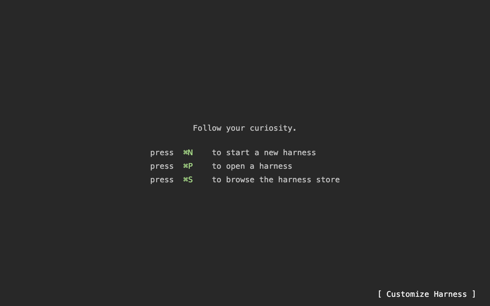

# Terminal workspace design system

Harness should feel like a terminal workspace, from its tab bar to its welcome
page, dialogs, and contextual controls. **Text first. Keyboard first. Fixed
cells.** Use this document for new workspace surfaces and visual reviews.

The [terminal dialog rules](terminal-dialogs.md) specify row and column geometry,
selection, input, and preview behavior. The [workspace status bar rules](workspace-status-bar.md)
specify tabs, pane headers, focused context, and model selection. Those documents
are the detailed implementation references for this system.

## Text is the interface

Use meaningful names and familiar terminal punctuation. Prefer `[ New Harness ]`
and `[ Customize Harness ]` to rounded buttons with pictograms. A checkbox is
`[x]` or `[ ]`. Search starts with `>`. Small, established actions may use `+`,
`@`, `:`, and `*`, with a descriptive tooltip and accessible name.

There is no broadly understood ASCII pencil. Keep `[ Customize Harness ]` after
customization as well as before it. The same action should retain its name and
location; a saved background must not silently replace it with an unlabeled icon.
Over artwork, a flat backing may protect text contrast. Do not add a pill,
bordered button well, logo, emoji, or ornamental icon to workspace controls.
User content and embedded viewers retain their own visual language.

## Keyboard is the primary path

Every workspace action needs an existing command or a clear keyboard interaction.
Resolve shortcut hints from the live keymap. Cmd-N creates a harness, Cmd-O opens projects (`#`), Cmd-P searches harnesses, and Cmd-Shift-P opens
commands (`>`) in the shared picker. Cmd-T opens a tab, Cmd-W closes a tab, and
Cmd-Shift-W closes the focused pane view. Cmd-Q quits the app. Enter activates, Space toggles, and Escape backs out or dismisses.

Keep mouse access useful without adding duplicate floating controls. Clickable
text shows a hand cursor and a flat rectangular terminal-selection tint on hover,
press, and keyboard focus. Resting controls stay unboxed. Tooltips describe the
action, not merely the text. Omit a tooltip that repeats the visible name;
show the full name when truncated, or a different underlying name. A model
selector says `Switch model · Subscription or local models`; include its full
model name only when shortened or temporarily replaced by a switching label. Disabled controls must not advertise an available
action or receive keyboard activation. Preserve accessibility names and focus
restoration; terminal styling is not permission to replace real controls with
inaccessible painted text.

## Use a real character grid

Measure columns and rows through `terminalCellSizeOf(context)` for dialogs and
welcome content. Text, margins, choices, and scrolling follow those dimensions.
Dialog selection highlights exactly one text row. Keep fixed font metrics when space
gets tight; truncate long values or reduce the number of visible columns.

Persistent tab, status, and pane bars use `workspaceBarTextStyle()` and
`workspaceBarCellSizeOf(context)`: 13 pt SF Mono regular on macOS and the platform
monospace stack on Linux, independent of terminal zoom. Every bar control uses
the same flat rectangle: `workspaceBarControlHeight()` (28 pt minimum), terminal
selection at 50% opacity on hover/press/focus, and full selection color for the
active tab. No rounded corners, ripple, or separate model-label well. Dialogs and welcome
actions use `terminalContentStyle()` and follow the terminal font preference.

## Keep surfaces quiet

First launch uses the same New Tab page as every later visit: “Follow your
curiosity.” with New Harness, Open Harness, and Harness Store shortcuts. Keep
this page independent of onboarding progress; no checklist or automatic dialog.

Use terminal foreground, background, muted text, and selection colors. Workspace
dialogs use the same thin frame as a focused pane. Avoid raised cards, shadows,
rounded action pills, and redundant headings. Tabs use concise text labels, with
selection conveyed by background rather than bold type.

Status layouts and terminal palettes are separate choices. **Plain** always uses
the terminal foreground, including PR status. Other status presets use the
terminal's ANSI colors; Color off makes any preset monochrome. Do not invent
runtime facts, Git dirtiness, exit status, or progress to decorate a theme.

## Make context useful

Show the focused pane's model, machine, compact project name, branch, and PR in the
shared app bar. A dependent viewer uses its owner's context. Keep internal
worktree paths and machinery out of everyday labels.

Machine opens the shared picker scoped to that machine. Project opens its harnesses across
known checkouts and machines. Branch narrows that project to the exact branch or
detached commit. These are navigation actions; they do not check out a branch.
The PR label opens that PR. Each field gets its own accessible link, tooltip, and
the shared hover treatment, including in joined Agnoster segments.

## Review in context

Check keyboard-only operation, hover, focus, disabled state, narrow windows,
long names, missing Git data, a dependent viewer, light and dark palettes, and
terminal font changes. Opening or dismissing controls must not send input to an
agent or recreate its terminal. Use synthetic data for screenshots.

Start with `TerminalTextAction`, `WorkspaceBarControl`, `WorkspaceStatusLine`, and
the Cmd-N/Cmd-O reference implementations. Native macOS controls must match the
Flutter fallback in behavior and appearance.
