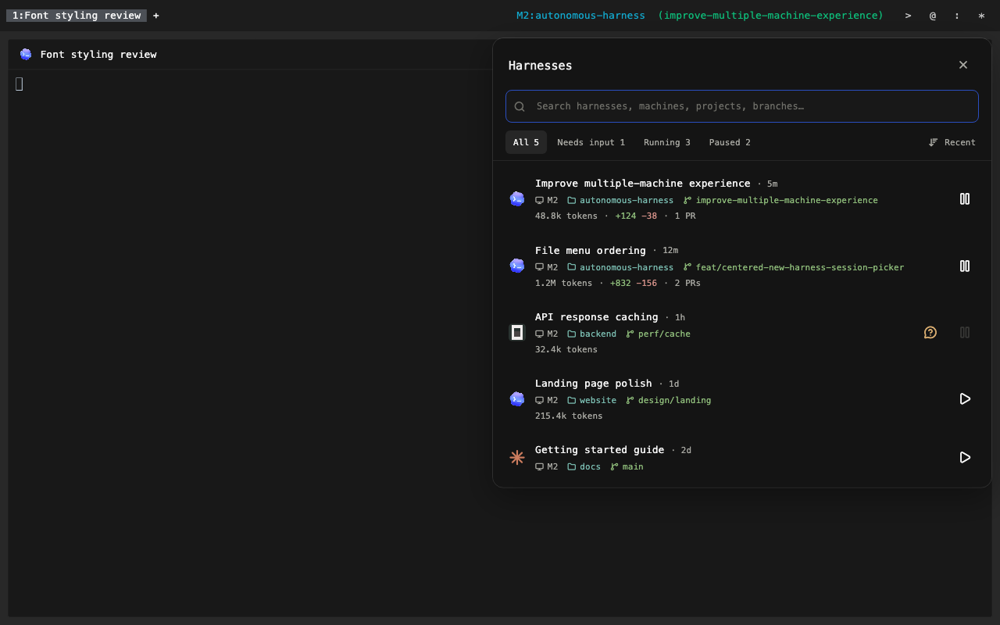
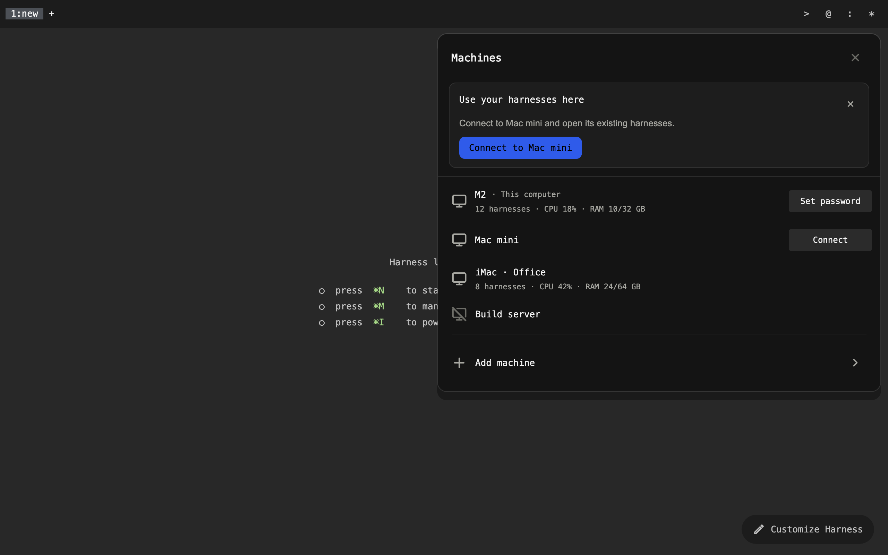

# Workspace status bar

One shared status line, using compact monospace text and measured character cells.
Follow the [terminal workspace design system](terminal-workspace.md).

```text
1:api  2:web  3:blender  +                 M2  autonomous-harness  (main)    >   @   :   *
```

## Tabs on the left

Each tab shows its number and a compact name. A user-entered name always wins:
once renamed, keep it across pane changes, closing/reopening, and saved layout
restores. Use automatic naming only when `nameIsCustom` is false. Custom-named
tabs do not vote in the automatic-name comparison. Count independent
harness panes once per agent; dependent viewers do not vote. Consider harness
type (`code`, `blender`, etc.), project name, and machine name. Choose the most
widely shared trait in that tab. Among equally shared traits, prefer the name
least repeated in other tabs; otherwise prefer type, then project, then machine.
Ties within one trait use pane order. Focus does not affect the name.

This keeps `blender` useful beside coding tabs, uses project names when all work
is code, and uses machine names for the same project on different computers.
Tabs with identical contents can still share a name; their numbers distinguish
them. Preserve the full name for inspection when its visible label is truncated.

Center the text with one cell of padding on each side. Cap long labels at 24
cells and scroll overflow, revealing the selected tab on keyboard navigation.
There is no close button or reserved close-button space. Cmd-W closes the active
tab; preserve remapped shortcuts, native menu access, and middle-click closing.
Preserve reorder, rename, keyboard focus, and terminal sessions. Cmd-T opens a
tab. Cmd-O opens the shared picker with `#` for projects; Cmd-P opens it directly
on harnesses. Cmd-Shift-P opens commands (`>`). The projects list has
no New Project/Open Folder row. Projects with an open pane in any tab come first;
each group is alphabetical. Pane focus and navigation history do not change that
order. Cmd-Q retains its native Quit action.

Tabs, status fields/symbols, PRs, and model labels and pane close actions share `WorkspaceBarControl`
in Flutter and the same native draw metrics: 28 pt minimum highlight height,
flat corners, and the terminal selection color at 50% opacity for hover, press,
and keyboard focus. The active tab uses that same rectangle with full selection
opacity. Keep the 13 pt regular text centered; no ripple or rounded button well.

Do not show a tooltip that repeats a visible tab name (the numeric prefix does
not make it a different name). Show a different underlying name or the full
label when it is truncated. Keep action hints on symbols and status links.

The new-tab `+` uses the same plain-text control as `>` `@` `:` `*`: no resting
box, with a flat rectangular terminal-selection highlight on hover or keyboard
focus. Keep its New Tab tooltip and shortcut hint.

Tab labels, status text, pane titles, and model selectors use **13 pt SF Mono,
regular weight** on macOS. Linux uses its platform monospace stack at the same
size. Use `workspaceBarTextStyle()` and `workspaceBarCellSizeOf(context)` from
`lib/shared/theme/workspace_bar_style.dart`; the native bar receives that same
font through `barStyle`. Keep this size independent of terminal zoom and avoid
an additional UI text-scale factor. Selection uses background color, not bold.
Terminal content and dialogs still follow the user's selected terminal font
and size.


## Pane controls

The shared bar shows the focused harness's model selector before machine and
project. Pane headers keep the harness title and a hover-only ASCII `x` at their
far right. The `x` closes that pane view, keeps its harness running, and uses the
shared flat highlight. Its tooltip names Close Pane and the current shortcut.
Reserve its width so revealing it does not move the title.

For the model label, prefer
its local model ID or the daemon's observed subscription model (`selectedModel`),
such as `GPT-6 Astra`, `Fable`, or `Opus`. Keep versions when reported; never infer
a version from a family alias. Older daemons fall back to the provider name.
Keep this label visible without requiring hover, including while disconnected;
disable switching when the pane is read-only. Use a hand cursor, subtle hover and
keyboard-focus fill, and a tooltip explaining subscription/local switching.
Do not repeat the model name in that tooltip unless it is truncated or replaced
by `Switching…`. Preserve useful capability details and full truncated names
while offline, but do not advertise switching when it is disabled.
A model update must repaint the label without reopening or retargeting the pane.
The observed subscription model does not select a Local row in the picker.

Zoom and Stop remain keyboard/menu actions. Cmd-Shift-W closes the focused pane
view, Cmd-W closes the tab, and Cmd-Enter toggles pane zoom. Closing a view
keeps its harness running; Stop Harness remains a separate command with its
existing confirmation. Preserve explicit user keymap overrides.

Pane edges have no floating split buttons. Split Right and Split Down remain
keyboard commands (Cmd-R and Cmd-D by default), with File menu and command-search
access. Keep the resize gaps available for resizing.

Restart Harness and Share Harness belong in File. Fork remains available in
command search. Viewer and message-composer toggles belong in View and command
search. These actions apply to the focused pane; sharing and viewer visibility
follow a dependent viewer's owner.

## Focused context on the right

Show the focused model, then `machine  project`, then `(branch)` when known.
The model is a separate plain text control so switching themes preserves its
click target. A focus change closes its picker; stale native actions and delayed
model selections cannot retarget a different harness.
Use the shared `AgentProject.label` rule: at a Git root, prefer the remote repo's
name, falling back to the local repo name; in a repo subfolder, use that folder's
name; outside Git, use the ordinary folder name. A worktree follows exactly the
same rule. Its generated path and `[worktree]` marker do not belong in the bar.
Keep the full actual path in the tooltip and accessibility detail.

A focused viewer shows its owning harness's context. Omit absent project or Git
metadata; detached commits say `detached:<commit>`. Clear it for an empty tab.
Each field is independently clickable, with the same flat hover/keyboard-focus
tint and hand cursor as the status symbols. Machine opens the shared picker scoped by machine
identity; project opens its harnesses across matching remote checkouts; branch
opens that project filtered by its exact branch or detached commit. Escape returns
from branch to project, then to project search. Names never establish identity.
Branch navigation does not check out or create a branch.

Customize Harness → Status offers six saved themes with a colored preview of
the same sample pane beneath each choice. Selection covers only the name row.
The selected theme also previews PR status. Previews inherit the terminal font,
cell size, and ANSI palette; the workspace bar uses the fixed 13 pt bar font.
Controls keep the plain terminal design.

| Theme | Treatment |
| --- | --- |
| Plain (default) | Monochrome `machine  project  (branch)`, including the PR |
| Robbyrussell | Green arrow, cyan project, blue `git:(` with red branch |
| Pure | Blue project, muted machine/branch, magenta prompt mark |
| Agnoster | Joined black context, blue project, and green branch segments |
| Powerlevel10k Lean | Unboxed yellow machine, blue project, green branch and ASCII `>` |
| Spaceship | Cyan project and magenta branch, with `in` / `on` separators |


These are one-line visual adaptations, not installed shell themes. Powerline
separators are drawn one-cell shapes and do not require patched fonts. Prompt
marks and segment colors are decorative; they never invent dirty, ahead/behind,
privilege, or exit-status readings. Plain retains familiar parenthesized branch notation; Zsh's actual stock prompt is `%m%# ` (host and prompt character).

The rightmost PR label belongs to the focused harness, including when its viewer
has focus. Display `#298 Merged` (or Draft/Open/Closed), with a separate link
to that PR. Plain themes leave one text cell before the label. Segmented themes
connect it directly to the preceding arrow, making one continuous bar while
retaining the PR click target. The selected-theme preview
shows that same joined line. State colors come from the terminal palette:
muted for Draft, green for Open, magenta for Merged, and red for Closed. Turning
Color off applies a monochrome treatment to context and PR together. Plain always
uses the terminal foreground even when Color is enabled. Existing `standard`
settings resolve to Plain; existing `powerlevel10k` settings resolve to Lean.

References: [Oh My Zsh themes](https://github.com/ohmyzsh/ohmyzsh/wiki/Themes),
[Pure](https://github.com/sindresorhus/pure),
[Powerlevel10k Lean](https://github.com/romkatv/powerlevel10k/blob/master/config/p10k-lean-8colors.zsh),
and [Spaceship](https://github.com/spaceship-prompt/spaceship-prompt).
These are compact adaptations; machine/project/branch/PR remain real Harness data.

Read PR status through the owning machine's existing `git_pull_request` RPC.
Refresh once per minute while focused, reuse recent results across focus
switches, and discard stale replies after a pane, branch, or project change.
Unknown, absent, or inaccessible PRs have no label. Never display a previous
pane's PR while waiting for the newly focused one. Compact pane headers do not
also poll or display PR status.

References: [Zsh prompt parameters](https://zsh.sourceforge.io/Doc/Release/Parameters.html),
[Oh My Zsh themes](https://github.com/ohmyzsh/ohmyzsh/wiki/Themes),
[Robbyrussell source](https://github.com/ohmyzsh/ohmyzsh/blob/master/themes/robbyrussell.zsh-theme),
[Pure](https://github.com/sindresorhus/pure),
[Agnoster](https://github.com/agnoster/agnoster-zsh-theme), and
[Powerlevel10k](https://github.com/romkatv/powerlevel10k).

Pane headers keep task identity and model selection. Four text symbols sit at the far
right, after the focused context and PR: `>` Harnesses, `@` Machines, `:` Models,
and `*` Store. Use the same compact monospace font, size, weight, and baseline as the
status text. Each symbol is centered in an equal four-column slot (at least
28 points wide) with an equally sized click target. In narrow windows, reduce
all four slots together in whole columns. Keep the symbols plain at
rest; hovering, pressing, or keyboard focus adds a flat selection tint and
brightens the text. A hand cursor, descriptive tooltip, and accessible button
name make each action discoverable. Do not show a help symbol for now.

Harnesses opens the existing session manager with Pause and Resume. Machines
opens its connection/password panel, Models opens its management panel with
download/start/stop controls, and Store opens the Store tab. Cmd-O opens projects, Cmd-P opens
harnesses, and Cmd-Shift-P opens commands in the unified picker; prefixes switch its resource type.





Reserve the symbols' width before laying out tabs and context. Leave a window drag
area between tabs and context and prevent overlap in narrow windows. Native
menus and commands remain available.

Data rules live in `lib/state/workspace_status.dart`; prompt formatting lives in
`lib/shared/theme/status_line_style.dart`. Flutter draws the fallback bar in
`SwarmScreen`; macOS draws `SwarmTabStrip` in `macos/Runner/SwarmTitlebar.swift`.
Both use the same names, formatted context, resolved text/color segments, and
preferences. `WorkspacePullRequest` owns focused PR state; the native and Flutter
bars receive the same validated label and URL. Checks live in
`workspace_status_test.dart`, `workspace_pull_request_test.dart`,
`status_line_test.dart`, and `tool/swarm_titlebar_checks.swift`.
