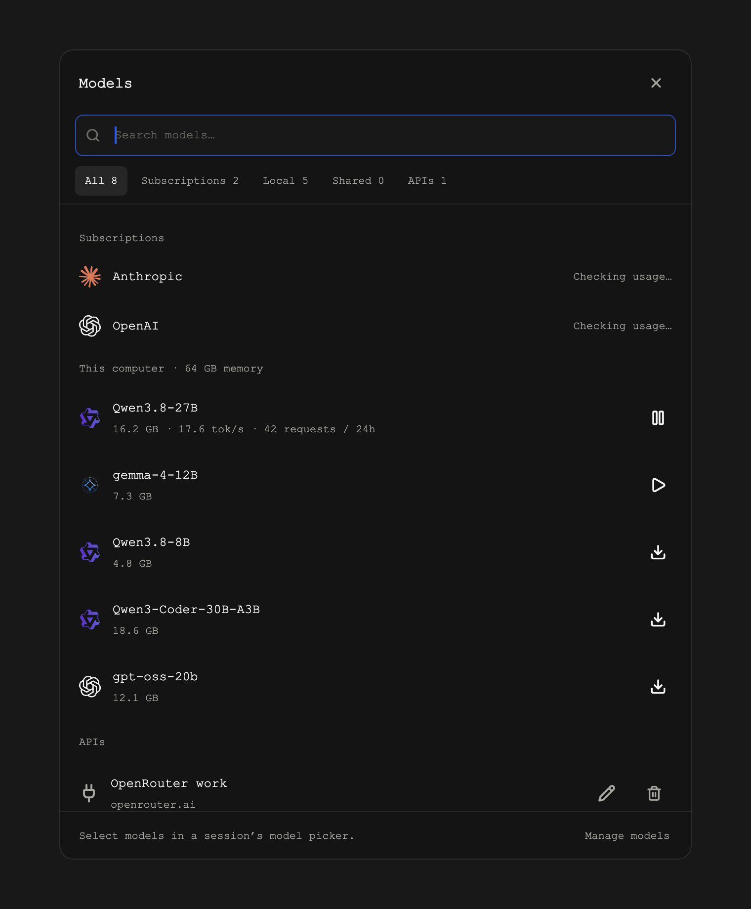
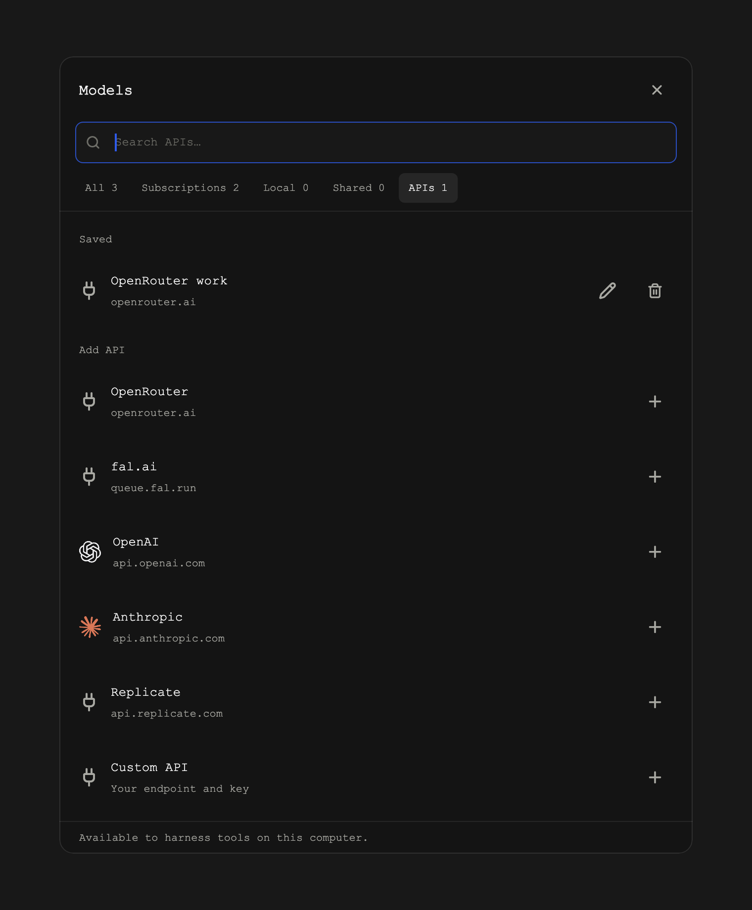
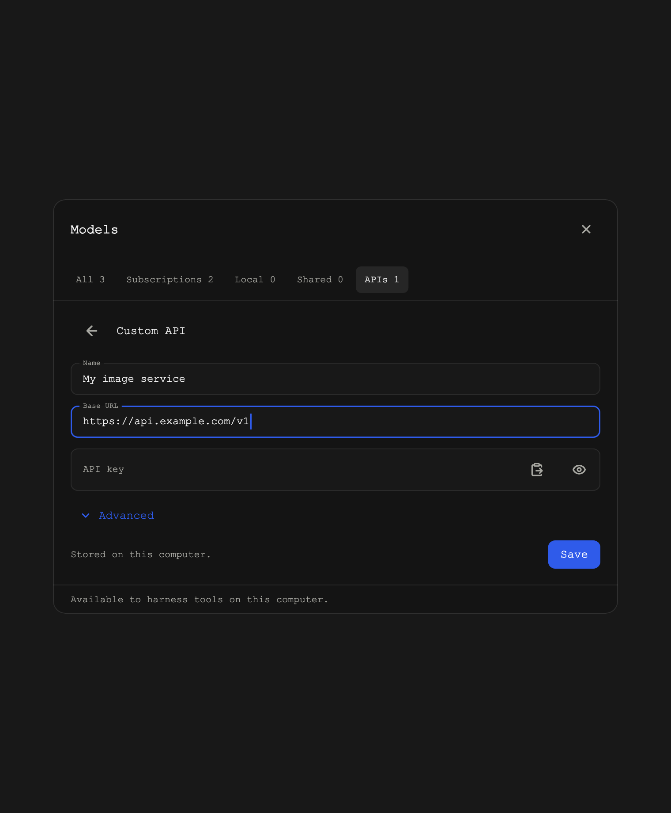

# Saved APIs

Models opens on **All**, with subscriptions, local models, shared models, and saved
APIs grouped in one searchable view. The source tabs narrow the list.



Open **Models → APIs**, choose a provider, paste its key, and select **Save**.
The clipboard icon pastes the key directly; it remains hidden until you reveal it.
OpenRouter, fal.ai, OpenAI, Anthropic, and Replicate have presets. **Custom API**
accepts a name, base URL, and key; **Advanced** controls the key environment
variable, authentication header, and optional prefix.



Connections are available to every local harness's tools. They do not change
the harness's selected model or subscription. Saving stores the connection;
it does not call the provider, validate account credit, or make a paid request.

To edit a connection, select its pencil icon. Leave the key blank to keep the
saved key, or paste a replacement. The trash icon removes the saved connection
after confirmation; revoke the key at the provider if it should stop working
outside Harness too. Multiple named connections to one provider are supported.



## Using a connection

Harness adds a short **Saved APIs** instruction section when starting, restarting,
or forking a local harness while connections exist. It preserves existing project
instructions and appends the section only once, in `AGENTS.md` (`CLAUDE.md` for
Claude, `GEMINI.md` for Gemini). The section contains commands, never credentials.
Already running harnesses can use those commands immediately:

```sh
# Discover connection IDs and public settings. Keys are never listed.
harness api list --json

# Authenticated JSON API request; the path is relative to the saved base URL.
harness api request openrouter /models
harness api request my-images /render --method POST --data @request.json

# Give a provider SDK or tool its saved key environment variable.
harness api run fal-ai -- node generate-image.mjs
```

Use the ID returned by `list`; renaming an existing connection preserves its ID.
`request` attaches the configured authentication header, returns the response
body, and exits nonzero on network/HTTP failure. It does not follow redirects.
`run` passes the selected key variable and `HARNESS_API_BASE_URL` to the child
process only; an SDK may need its base URL configured explicitly. Its arguments,
standard input/output, and exit code pass through normally.

Header-based JSON APIs work with `request`. Other protocols and authentication
schemes can use their own SDK/tool through `run`; Harness does not provide OAuth
sign-in or provider-specific polling and file-upload interfaces.

## Storage and scope

The local CLI stores keys in `api-connections/connections.json` inside its data
directory (`~/.harness/cli/data` by default), with owner-only directory/file permissions
(`0700`/`0600`). This is a local credential file, not an OS keychain. Writes are
atomic, and unreadable/corrupt storage is never silently replaced.

Management requests use the local daemon connection; remote requests are refused.
Keys are not returned to the UI, included in connection lists, copied into project
instructions, or exported into an engine's environment. An explicitly invoked
tool receives the selected credential. Connections do not sync between machines.

Preset defaults come from the providers' documentation:
[OpenRouter](https://openrouter.ai/docs/api/reference/authentication),
[fal.ai](https://fal.ai/models/fal-ai/flux/dev/api),
[OpenAI](https://developers.openai.com/api/reference/overview),
[Anthropic](https://platform.claude.com/docs/en/api/overview), and
[Replicate](https://replicate.com/docs/reference/http).

## Validation

```sh
cd cli
npm run typecheck
npx vitest run src/lib/apiConnections.spec.ts src/lib/apiCommand.spec.ts src/lib/apiConnectionsRpc.spec.ts

cd ../desktop
flutter test --coverage test/api_connections_test.dart test/models_panel_test.dart test/model_mark_test.dart test/model_manager_controller_test.dart
node tool/check_models_coverage.mjs
```

Backend tests use synthetic credentials and a local HTTP server. They cover
storage/rotation/removal, all preset defaults, custom authentication, child-process
isolation, HTTP success/failure/redirect handling, local-only RPCs, and instruction
preservation. UI tests cover forms, key masking, validation, search, repeated
providers, editing/removal, reconnects, stale responses, and small windows.
