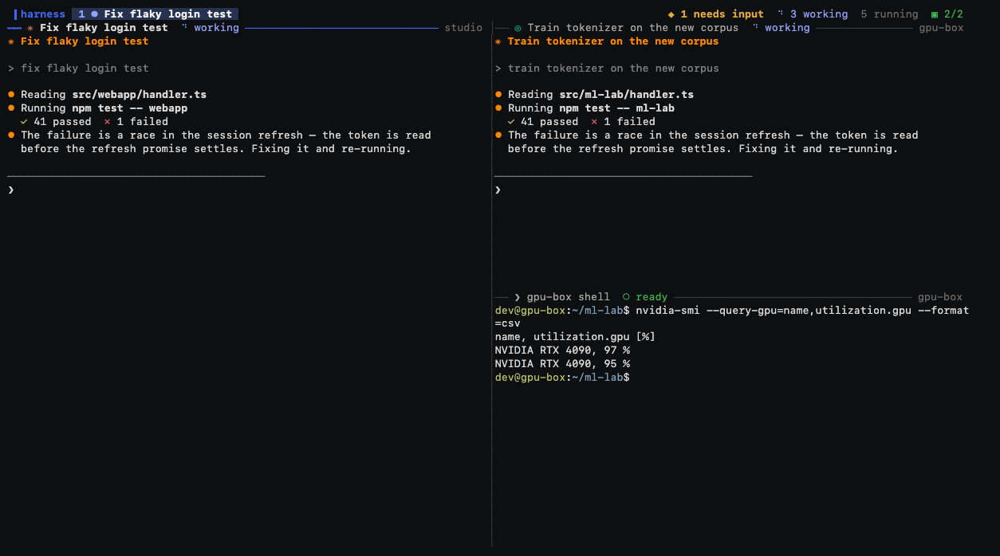
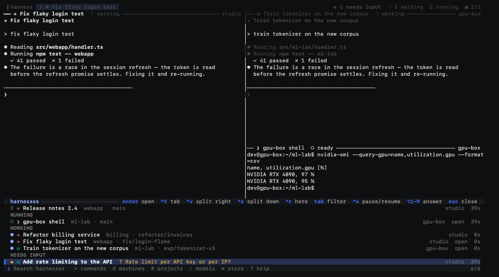

# hn — tmux improved

All of Harness in a terminal — every harness on every machine, in tabs and panes, from any
terminal you can type into: a laptop, a server over SSH, a tablet's SSH app.

```bash
curl -fsSL https://harness.autonomous.ai/cli/install.sh | bash    # installs harness and hn
hn                                                                 # or: harness tui
```

vim is vi improved: every vi key works, and more. hn is that for tmux — every tmux key and
`~/.tmux.conf` line works, with every harness on every machine behind them. What tmux users have
asked for over the years, and what hn does about it: [docs/tmux-improved.md](docs/tmux-improved.md).





<sub>Screens from the demo fleet in `tests/mock-daemon.mjs` (`MOCK_DEMO=1`).</sub>

It is a **client of the same daemon the desktop app uses**. Nothing runs inside it: the agents
live in the daemon's tmux on their own machines, and each pane is a live stream of one of them.
Close it, lose the connection, reopen it anywhere — everything is where you left it, because
your tabs are the account's **desk**, the same tabs the desktop and the phone show.

On a fresh server `hn` signs in (over SSH the login prints a URL and takes the pasted
callback), starts the daemon, then opens — as `tmux new -A` does: your tabs if the desk has any,
else window 0 is a shell on this computer, in the folder you ran `hn` in. `C-b s` finds every
harness. Closing the last window ends `hn` (`[exited]`, as tmux says it); `C-b d` detaches.

## Keys

tmux's. The prefix is `C-b`; `C-b s` then `C-v`, `C-x` or `C-t` puts any harness beside, below or in a new window; every default tmux binding does what it does in tmux, with a window
being a tab and a pane being a harness. If you have a `~/.tmux.conf`, it is read: your prefix and
binds (copy-mode-vi's and vim-tmux-navigator's too), `source-file`, `if-shell`, `base-index`,
`renumber-windows`, `mouse`, `mode-keys`, `status-left`/`status-right` and the window formats
(`#[…]` styles, `#{?…}`, `%H:%M`), `pane-border-format`, `synchronize-panes` and your colours come
with you. It is read as tmux reads it (tmux's own parser, ported): quotes and escapes, `$VAR` and
`~`, `VAR=value` and `%hidden`, `%if`/`%elif`/`%else`, `{ }` blocks, `source-file` globs — the
whole file checked first, so a bad line is `file:line: why` and none of that file runs, as in
tmux. `run-shell` lines run too: a plugin's `tmux …` reaches hn (the `tmux` on its PATH is hn),
never a tmux server you have running.

Splits, `resize-pane`, the seven layouts, `swap-pane`, `rotate-window`, `join-pane`, `break-pane`
and `select-pane` are tmux 3.5a's own arithmetic (layout.c, window.c): the same sizes, the same
pane numbers and the same active pane after each. Some defaults differ, and your `.tmux.conf`
overrides each: `pane-border-status top` (each pane's title row: its harness's state and name, and
its project and branch where the pane has room), `allow-set-title off` (a pane's title is its
harness's name, not what the program sets), `history-limit 10000` (agents print a lot; tmux keeps
2000), `mouse on`, and the status line: each window's most urgent harness state before its name,
and on the right the focused pane's machine (when it is another one), project and branch —
`gpu-box:ml-lab git:(main)` — where tmux shows the pane's title.

| tmux keys | |
|---|---|
| `C-b s` | every harness on every machine — an fzf list with a live preview |
| `C-b c` | new window (a shell) |
| `C-b %` `C-b "` (`\|` `-`) | split right / below — a shell, at once, in this pane's machine and folder |
| `C-b o` `C-b ;` `C-b ←↑→↓` `C-b q` | next pane, last pane, pane in a direction, pane numbers |
| `C-b z` `C-b space` `C-b M-1…7` `C-b { }` `C-b C-o` | zoom, next layout, a layout, swap, rotate |
| `C-b C-←↑→↓` `C-b M-←↑→↓` | resize (repeatable, like tmux's `-r`) |
| `C-b n` `C-b p` `C-b l` `C-b 0…9` `C-b w` `C-b ,` `C-b &` | windows |
| `C-b x` | close the pane (the harness keeps running) |
| `C-b [` `C-b ]` | copy mode (tmux's, vi or emacs keys as `mode-keys` says), paste |
| `C-b <` `C-b >` | the window and pane menus |
| `C-b /` | what a key does |
| `C-b :` | the command prompt — tmux commands, `Tab` completes |
| `C-b ?` | every key and what it does (`list-keys -N`) — or just pause after `C-b` and they show |
| `C-b d` | detach — everything keeps running |

Harness's own, only on keys tmux leaves unbound (every tmux key does what tmux does):

| | |
|---|---|
| `C-b a` / `C-b A` | next harness waiting on you / all of them (`M-1…9` answers from the list) |
| `C-b N` `C-b T` | new harness (an agent) / new terminal |
| `C-b I` `C-b @` `C-b S` | models, machines, the Harness Store |
| `C-b g` `C-b B` | send a task (Harness picks the harness) / broadcast to the window |
| `C-b R` `C-b P` `C-b K` | restart, pause, clone the harness |

In every list, fzf's keys: `C-j/C-k` `C-n/C-p` move, `Tab` marks, `C-/` toggles the preview,
`S-↑/↓` scrolls it, `M-/` wraps long rows (`--wrap`), `C-a C-e C-w C-u` edit the query, `enter`
opens, `C-t` in a new window, `C-v` beside, `C-x` below, `esc` leaves. fzf's search syntax works
(`'exact ^prefix suffix$ !not a | b`), and its colours follow `FZF_DEFAULT_OPTS` (`--color=light`,
`16`, `bw`). One key differs on purpose: fzf 0.67 binds `ctrl-/` to toggle-wrap as well as `alt-/`,
but hn keeps `C-/` for the preview, as fzf's own README binds `ctrl-/` in its preview examples and
most people's fingers already know it.

Colours are the terminal's 16, as tmux's are, so hn reads on dark, light and Solarized themes.

## At a glance

Every harness's state is one symbol, the same in its pane's title row, the window list and `C-b s`
(a plain shell has none). A window shows its most urgent pane's, and a window with a harness
waiting on you is reversed, as tmux shows a bell.

| | |
|---|---|
| `⠹` (turning) | working |
| `?` | needs you: a question or a permission |
| `✓` | done, and you haven't looked yet |
| `·` | idle |
| `✗` | failed |
| `◌` `‖` `○` | starting, paused, offline |

For your own formats: `#{pane_agent_icon}` and `#{pane_agent_state}` (needs, working, done, idle,
starting, failed, paused, offline), `#{window_agent_icon}` and `#{window_agent_state}` (its most
urgent pane's), `#{pane_project}`, `#{pane_branch}`, `#{pane_machine}`, `#{pane_far}` (another
machine's), and `#{waiting}` (harnesses waiting on you).

## From a shell

As `tmux` is: any tmux command, run in the client you have open, its output printed here.

```bash
hn display -p '#{pane_current_path}'
hn send-keys -t 1 'make test' Enter
hn capture-pane -p -t 0 | tail
hn list-panes -F '#{pane_index} #{pane_title}'
hn list-harnesses            # every harness on every machine (hn ls is list-sessions, as in tmux)
hn send-message -t api 'run the tests'   # a message to a harness, as a turn (hn send is send-keys, as in tmux)
```

## Copy mode

tmux's own (window-copy.c, ported): `C-b [` takes a copy of the pane's screen and history, and
every key is looked up in the `copy-mode-vi` table (`mode-keys vi`) or `copy-mode` (emacs) and runs
tmux's command for it — so `v` `Space` `Enter`, `C-Space` `C-e` `M-w`, `/` `?` `n` `N`, `C-s`
`C-r` (incremental), `f` `t` `;` `,`, `5k`, `%`, `{` `}`, `X` `M-x`, the search marks and their
count, and your own `bind -T copy-mode-vi …` all do what they do in tmux. `r` takes the copy again
(output that arrived meanwhile is `#{pane_unseen_changes}`); `q` leaves.

What a command prints — `C-b ?`, `C-b ~`, `:show -g`, `:list-windows`, `run-shell` — opens in the
pane's view mode, as in tmux: the same keys move and search it, `q` closes it. The same list of
keys to search as you type, fzf-style, is `C-b s` then `>` and `keys`.

## Mouse and clipboard

tmux's mouse: a click selects a pane or a window, a drag on a border (or a title row) resizes, a
drag in a pane selects and copies, a double-click copies a word and a triple-click a line, the
wheel scrolls back in copy mode, and the right button opens tmux's pane, window and session
menus. Each is a key binding you can change, as in tmux (`bind -n WheelUpPane …`, `bind -T
copy-mode-vi MouseDragEnd1Pane …`); a program that asks for the mouse gets it. Hold `⇧` to select
with your terminal instead. Copying uses OSC 52, so it lands on the clipboard of the computer you
are sitting at, over SSH too.

## Two windows, one harness

A terminal has one keyboard. Opening a harness another window is driving shows it read-only
("watching"); the first key you type takes it over, and the other window starts watching.

## The dial

The Harness device, plugged into this computer: the daemon holds it, and hn is the window it
talks to while the desktop app is not running. (With the app open, the app keeps the dial; hn
still follows it while hn's terminal is the one in front.)

- **Turn it** to a harness: its pane is selected, in its window. A zoomed window stays zoomed, so
  the dial flips through panes full size.
- **A finger on the glass** scrolls the active pane the way tmux's wheel does: a shell's history in
  copy mode (left again at the bottom), a full-screen program its wheel or arrow keys, an open
  list its rows. A flick keeps going and slows down.
- **Tap a notification**: that harness comes forward, or opens in a new window.
- **Pick a window** on the dial: it is selected here.
- **Speak** on a harness and the words go to it. Speak with none chosen and hn routes them as
  `send-task` does: sent at once when the router is sure, otherwise the list asks (Enter sends,
  Esc cancels).

The dial turns through the panes of the window you are on, in pane order, and its window list is
hn's windows.

## Speed

Each pane's header shows its measured keystroke → echo latency. On this machine that is about a
millisecond. On another machine it is the network: when a pane measures slow (≥20ms), typed
characters are echoed locally — underlined until the far side confirms them, the way mosh does.
`HARNESS_TUI_PREDICT=off` turns that off, `=always` forces it on.

## Your keys

`~/.tmux.conf` first (`HARNESS_TUI_TMUX_CONF=off` ignores it, `=path` reads another file); then
`~/.config/harness/tui.toml` for anything specific to Harness:

```toml
prefix = "C-a"
desk = "sync"              # sync | read | off
predict = "auto"           # auto | always | off
notify = true              # OS notifications through the terminal

[keys]                     # the root table: no prefix
"M-h" = "select-pane -L"
"M-x" = "none"
```

`hn --keys` lists every binding, tmux-style, and reports problems in either file.

## Environment

| Variable | |
|---|---|
| `HARNESS_TUI_DESK=read` | show the desk's tabs, never change them |
| `HARNESS_TUI_DESK=off` | keep tabs to this window |
| `HARNESS_TUI_PREDICT` | `off` / `always` (see Speed) |
| `HARNESS_TUI_BIN` | the binary `harness tui` runs |
| `PORT` | the daemon's port (default 18473) |
| `HN_DESKTOP=on` / `off` | whether the desktop app is running, instead of looking (see The dial) |

## Building

```bash
cd tui && cargo build --release        # target/release/harness-tui
cargo test
```

`harness tui` finds a dev build in `tui/target/` on its own. hn contains code translated from tmux and
fzf and links the crates in `Cargo.lock`; their notices are in `THIRD_PARTY_NOTICES.md`, which the binary
carries (`hn --licenses`). After changing dependencies, run `python3 scripts/notices.py` (`cargo test`
fails until you do). Releases are built by
`.github/workflows/release-tui.yml` — static binaries for macOS (arm64, x64) and Linux (x64,
arm64, musl) with a checksummed manifest that `harness tui --install` verifies.

## Layout of the code

| File | |
|---|---|
| `daemon.rs` | the loopback WebSocket per machine, requests, pushed frames |
| `proto.rs` | `HTRL` terminal frames (mirrors `cli/src/lib/terminalBinary.ts`) |
| `pane.rs` | one tile: `alacritty_terminal` grid, key/mouse encoding, selection, find, local echo |
| `app.rs` | all state: machines, streams, tabs, desk sync |
| `fleet.rs` | machines and harnesses, kept live from the daemon's frames |
| `input.rs` | keys, mouse, the launcher's modes and actions |
| `dial.rs` | the Harness device: the ring and windows it turns through, its focus, scroll, taps and spoken tasks |
| `modal.rs` / `picker.rs` | the launcher's rows and its fzf matching (nucleo) |
| `ui.rs` | drawing |
| `layout.rs` | the split tree |
| `mouse.rs` | tmux's mouse: events as mouse keys, drags, what a program in a pane is sent |
